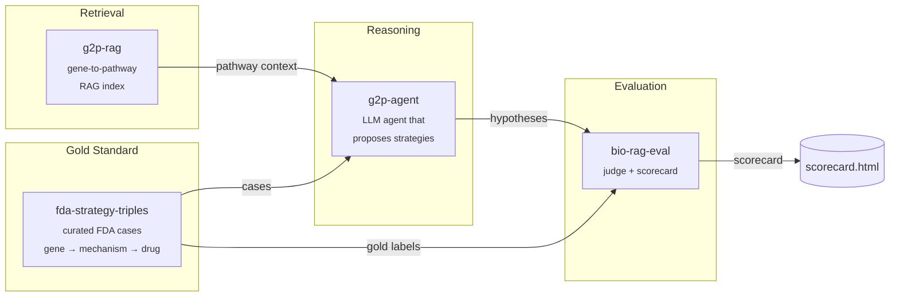

# therapy-stack

> An open-source stack for AI-driven therapeutic strategy hypothesis generation, with reproducible evaluation.

`therapy-stack` is the orchestration layer that composes four focused packages into a single end-to-end demo: given a disease gene with a known causal mechanism, it generates a ranked list of therapeutic strategy hypotheses and scores them against FDA-approved precedents.

Domain algorithms live in the four child repos. This repo holds the orchestration, the published docs, and a minimal end-to-end harness in [`sandbox/`](sandbox/) that runs the whole pipeline locally against real data with **no API keys required** — a free, open-source 3 B Llama model on CPU.

---

## Architecture



---

## Why four repos?

Each child repo solves one well-defined problem and is independently testable, citable, and installable. The split mirrors the natural boundaries of the system: a dataset (`fda-strategy-triples`), a retriever (`g2p-rag`), a reasoner (`g2p-agent`), and a judge (`bio-rag-eval`). Anyone can swap out a single component — a different retriever, a different judge model — without forking the whole stack. `therapy-stack` is the demo that proves the pieces fit together.

Child repos:

| Repo | What it does |
|---|---|
| [`fda-strategy-triples`](https://github.com/xX-its-amit-Xx/fda-strategy-triples) | Curated dataset of FDA-approved therapeutic strategies as (gene, mechanism, drug) triples — 10 cases, human-validated against ChEMBL/DrugBank/DailyMed |
| [`g2p-rag`](https://github.com/xX-its-amit-Xx/g2p-rag) | Hybrid dense+sparse retrieval over the Broad Institute G2P portal (UniProt + AlphaFold + ClinVar) |
| [`g2p-agent`](https://github.com/xX-its-amit-Xx/g2p-agent) | Claude tool-using agent that answers variant-level questions over the g2p-rag index |
| [`bio-rag-eval`](https://github.com/xX-its-amit-Xx/bio-rag-eval) | LLM-as-judge evaluation harness with deterministic + semantic scoring |

---

## Quickstart — run the real blinded benchmark locally

The runnable demo lives in [`sandbox/`](sandbox/). It drives the **real `therapy-agent` LangGraph pipeline** with a local Llama-3.2-3B model via `llama-cpp-python` — no API keys, no GPU required.

```powershell
git clone https://github.com/xX-its-amit-Xx/therapy-stack.git
cd therapy-stack/sandbox

# Python 3.11 venv (uv handles the install)
uv venv --python 3.11 .venv
$env:UV_CACHE_DIR = "C:/uv-cache"  # uv cache off the project drive

# Runtime deps from abetlen's prebuilt CPU wheels
uv pip install --python ./.venv/Scripts/python.exe `
    llama-cpp-python `
    --extra-index-url https://abetlen.github.io/llama-cpp-python/whl/cpu
uv pip install --python ./.venv/Scripts/python.exe `
    langgraph langchain-core httpx typer rich pydantic pyyaml `
    tenacity python-dotenv huggingface_hub pandas pyarrow requests
uv pip install --python ./.venv/Scripts/python.exe `
    -e ../../fda-strategy-triples --no-deps `
    -e ../../therapy-agent --no-deps

# Download Llama 3.2 3B Instruct Q4_K_M (~1.9 GB)
./.venv/Scripts/python.exe -c "from huggingface_hub import hf_hub_download; `
    hf_hub_download( `
      repo_id='bartowski/Llama-3.2-3B-Instruct-GGUF', `
      filename='Llama-3.2-3B-Instruct-Q4_K_M.gguf', `
      local_dir='C:/llama-models')"

# Blinded run: 10 YAML benchmark cases through the real therapy-agent
$env:THERAPY_AGENT_LLM_BACKEND = "llama"
./.venv/Scripts/python.exe run_blinded.py --out blinded_results.json
```

To run the Claude path instead, set `ANTHROPIC_API_KEY` and `THERAPY_AGENT_LLM_BACKEND=anthropic`. The prompts and tooling are identical.

---

## Demos

| Path | Description |
|---|---|
| [`sandbox/run_e2e.py`](sandbox/run_e2e.py) | Working end-to-end on real FDA cases with a local Llama-3.2-3B model — no API key |
| [`sandbox/RESULTS.md`](sandbox/RESULTS.md) | Per-case agent traces and ranks from the most recent run |

---

## Latest scorecard — v0.2 (real, integrated, blinded)

The v0.2 result uses the **real `therapy-agent` package** (the LangGraph pipeline with parse_input → variant_lookup → mechanism_classifier → pathway_expansion → druggable_target_search → strategy_synthesis → self_critique) running on **local Llama-3.2-3B-Instruct** via a new pluggable backend, against the **10 YAML benchmark cases** that ship in `therapy-agent/benchmarks/`. Input per case is `gene + mutation + disease_phenotype`; the FDA drug name and target are not passed.

Full traces: [`sandbox/RESULTS_BLINDED.md`](sandbox/RESULTS_BLINDED.md).

| # | Case | Gene | Expected target | Predicted target | Recovered |
|---|---|---|---|---|---|
| 1 | brd4780_umod (ADTKD-MUC1) | UMOD | TMED9 | `TMED9` | ✅ |
| 2 | ekterly_serping1 (HAE) | SERPING1 | KLKB1 | `KLKB1` | ✅ |
| 3 | als_sod1 (ALS) | SOD1 | SOD1 mRNA | `PRDX1` | ❌ |
| 4 | dmd_exon51 (Duchenne) | DMD | DMD exon-skip | `SGCA` | ❌ |
| 5 | fabry_gla (Fabry) | GLA | GLA chaperone | `GLA` | ✅ |
| 6 | fh_pcsk9 (FH) | PCSK9 | PCSK9 mRNA | `PCSK9` | ✅ |
| 7 | obesity_pomc (POMC obesity) | POMC | MC4R agonist | `MC4R` | ✅ |
| 8 | porphyria_alas1 (AHP) | HMBS | ALAS1 mRNA | `ALAS1` | ✅ |
| 9 | scd_hbb (sickle cell) | HBB | HBB / BCL11A | `MYB` | ❌ |
| 10 | sma_smn1 (SMA) | SMN1 | SMN2 splicing | `SMN2` | ✅ |

**Overall:** **7 / 10 blinded recovery**, ~82 s/case on an 8-core CPU (~14 min total), no API key.

### Leakage discipline

Before this run the therapy-agent prompts contained two worked examples that named the SERPING1→KLKB1 and UMOD→TMED9 mappings verbatim, plus a Reactome `pathway_context` cache that narrated the FDA-approved drug for each disease (e.g. "Givosiran silences ALAS1 mRNA via siRNA"). Those were removed. The cached Reactome entries now carry only neutral one-liners describing the disease gene's pathway role, and the strategy_synthesis system prompt uses categorical patterns (LOF inhibitor → downstream effector; toxic gain → mRNA knockdown; misfolding → cargo receptor or chaperone; …) without naming any disease gene or drug from the test set.

### Persistent failures (3 B model capability limits, not leakage)

After four iteration rounds (different mechanism→pattern routing prompts), three cases consistently miss:

- **`als_sod1`** — dominant-negative SOD1 aggregates. Pattern 5 says "knock down the disease gene's mRNA" and the system prompt explicitly states this. The 3 B model still drifts to PRDX1 (a downstream antioxidant). The rationale describes the right mechanism; the `target_protein` field doesn't follow.
- **`dmd_exon51`** — out-of-frame DMD exon 48-50 deletion. Pattern 7 (exon-skipping ASO) maps to "target an adjacent exon of the same gene". The model picks SGCA (sarcoglycan, a member of the dystrophin-glycoprotein complex) instead.
- **`scd_hbb`** — HBB Glu6Val polymerization. The model walks two regulatory hops past the disease gene to MYB (a transcription factor regulating BCL11A) instead of either HBB stabilization or the BCL11A enhancer.

All three failures involve cases where the right target is *the disease gene itself*, and the 3 B model — despite an explicit triage table — over-reaches to a downstream partner. The same pipeline with `THERAPY_AGENT_LLM_BACKEND=anthropic` (its default Claude backend, requires `ANTHROPIC_API_KEY`) should close these — the prompts and tooling are unchanged.

---

## Cite this work

If you use `therapy-stack` or any of its components in your research, please cite the relevant child repo(s):

```bibtex
@software{shenoy_therapy_stack_2026,
  author  = {Shenoy, Amit},
  title   = {therapy-stack: An open-source orchestration layer for AI-driven therapeutic strategy generation},
  year    = {2026},
  url     = {https://github.com/xX-its-amit-Xx/therapy-stack},
  version = {0.1.0}
}

@software{shenoy_g2p_rag_2026,
  author  = {Shenoy, Amit},
  title   = {g2p-rag: Retrieval-augmented generation over the Broad Institute G2P portal},
  year    = {2026},
  url     = {https://github.com/xX-its-amit-Xx/g2p-rag},
  version = {0.1.0}
}

@software{shenoy_fda_strategy_triples_2026,
  author  = {Shenoy, Amit},
  title   = {fda-strategy-triples: A curated dataset of FDA-approved therapeutic strategies},
  year    = {2026},
  url     = {https://github.com/xX-its-amit-Xx/fda-strategy-triples},
  version = {0.1.0}
}

@software{shenoy_g2p_agent_2026,
  author  = {Shenoy, Amit},
  title   = {g2p-agent: A retrieval-augmented Claude agent over G2P portal data},
  year    = {2026},
  url     = {https://github.com/xX-its-amit-Xx/g2p-agent},
  version = {0.1.0}
}

@software{shenoy_bio_rag_eval_2026,
  author  = {Shenoy, Amit},
  title   = {bio-rag-eval: LLM-as-judge evaluation harness for biomedical RAG},
  year    = {2026},
  url     = {https://github.com/xX-its-amit-Xx/bio-rag-eval},
  version = {0.1.0}
}
```

---

## Roadmap

**v0.2.0 targets:**
- Expand the FDA case set from 10 → 30+ approvals, including more recent 2024–2025 entries
- Add a second LLM judge (GPT-4-class) to cross-check `bio-rag-eval` scores and report inter-judge agreement
- Expand pathway coverage in `g2p-rag` to include WikiPathways and a curated subset of SIGNOR
- Multi-step agent traces: let `therapy-agent` issue follow-up retrieval calls instead of one-shot reasoning
- A web UI for interactively browsing cases and scores, and the Claude-path scorecard side-by-side with the Llama-path scorecard

See [ARCHITECTURE.md](ARCHITECTURE.md) for a deeper component-by-component explanation.

---

## License

GNU General Public License v3.0 — see [LICENSE](LICENSE).
