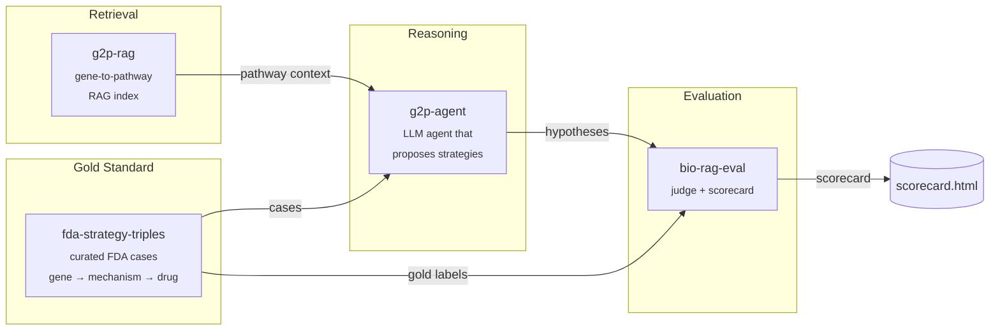

# therapy-stack

> An open-source stack for AI-driven therapeutic strategy hypothesis generation, with reproducible evaluation.

`therapy-stack` is the orchestration layer that composes four focused packages into a single end-to-end demo: given a disease gene with a known causal mechanism, it generates a ranked list of therapeutic strategy hypotheses and scores them against FDA-approved precedents.

Domain algorithms live in the four child repos. This repo holds the orchestration, the published docs, and a minimal end-to-end harness in [`sandbox/`](sandbox/) that runs the whole pipeline locally against real data with **no API keys required** — a free, open-source 3 B Llama model on CPU.

---

## Architecture



---

## Why four repos?

Each child repo solves one well-defined problem and is independently testable, citable, and installable. The split mirrors the natural boundaries of the system: a dataset (`fda-strategy-triples`), a retriever (`g2p-rag`), a reasoner (`g2p-agent`), and a judge (`bio-rag-eval`). Anyone can swap out a single component — a different retriever, a different judge model — without forking the whole stack. `therapy-stack` is the demo that proves the pieces fit together.

Child repos:

| Repo | What it does |
|---|---|
| [`fda-strategy-triples`](https://github.com/xX-its-amit-Xx/fda-strategy-triples) | Curated dataset of FDA-approved therapeutic strategies as (gene, mechanism, drug) triples — 10 cases, human-validated against ChEMBL/DrugBank/DailyMed |
| [`g2p-rag`](https://github.com/xX-its-amit-Xx/g2p-rag) | Hybrid dense+sparse retrieval over the Broad Institute G2P portal (UniProt + AlphaFold + ClinVar) |
| [`g2p-agent`](https://github.com/xX-its-amit-Xx/g2p-agent) | Claude tool-using agent that answers variant-level questions over the g2p-rag index |
| [`bio-rag-eval`](https://github.com/xX-its-amit-Xx/bio-rag-eval) | LLM-as-judge evaluation harness with deterministic + semantic scoring |

---

## Quickstart — run the real blinded benchmark locally

The runnable demo lives in [`sandbox/`](sandbox/). It drives the **real `therapy-agent` LangGraph pipeline** with a local Llama-3.2-3B model via `llama-cpp-python` — no API keys, no GPU required.

```powershell
git clone https://github.com/xX-its-amit-Xx/therapy-stack.git
cd therapy-stack/sandbox

# Python 3.11 venv (uv handles the install)
uv venv --python 3.11 .venv
$env:UV_CACHE_DIR = "C:/uv-cache"  # uv cache off the project drive

# Runtime deps from abetlen's prebuilt CPU wheels
uv pip install --python ./.venv/Scripts/python.exe `
    llama-cpp-python `
    --extra-index-url https://abetlen.github.io/llama-cpp-python/whl/cpu
uv pip install --python ./.venv/Scripts/python.exe `
    langgraph langchain-core httpx typer rich pydantic pyyaml `
    tenacity python-dotenv huggingface_hub pandas pyarrow requests
uv pip install --python ./.venv/Scripts/python.exe `
    -e ../../fda-strategy-triples --no-deps `
    -e ../../therapy-agent --no-deps

# Download Llama 3.2 3B Instruct Q4_K_M (~1.9 GB)
./.venv/Scripts/python.exe -c "from huggingface_hub import hf_hub_download; `
    hf_hub_download( `
      repo_id='bartowski/Llama-3.2-3B-Instruct-GGUF', `
      filename='Llama-3.2-3B-Instruct-Q4_K_M.gguf', `
      local_dir='C:/llama-models')"

# Blinded run: 10 YAML benchmark cases through the real therapy-agent
$env:THERAPY_AGENT_LLM_BACKEND = "llama"
./.venv/Scripts/python.exe run_blinded.py --out blinded_results.json
```

To run the Claude path instead, set `ANTHROPIC_API_KEY` and `THERAPY_AGENT_LLM_BACKEND=anthropic`. The prompts and tooling are identical.

---

## Demos

| Path | Description |
|---|---|
| [`sandbox/run_e2e.py`](sandbox/run_e2e.py) | Working end-to-end on real FDA cases with a local Llama-3.2-3B model — no API key |
| [`sandbox/RESULTS.md`](sandbox/RESULTS.md) | Per-case agent traces and ranks from the most recent run |

---

## Latest scorecard — v0.5 / v0.6 / v0.7 (full model + pipeline ablation)

After the v0.3/v0.4 blind-and-fix passes left the agent at 3-4/10 on a 3 B Llama, I tried all five upgrade levers from the prior round and ablated them against the same 10 YAML cases. Full per-case detail in [`sandbox/RESULTS_BLINDED.md`](sandbox/RESULTS_BLINDED.md).

| # | Version | Pipeline + model | Target | Hard cases | Easy cases | Modality | Wall (min) |
|---|---|---|---|---|---|---|---|
| v0.4 | original 6-node + Llama 3.2 3B | 3/10 | 3/5 | 0/5 | 3/10 | 17 |
| v0.5 | + decomposition + self-consistency + always-fire critique (still 3B) | 5/10 | 1/5 | 4/5 | 4/10 | 20 |
| v0.6 | same pipeline, Llama 3.1 8B | 6/10 | 2/5 | 4/5 | 7/10 | 34 |
| **v0.7** | **same pipeline, DeepSeek-R1-Distill-Llama-8B** | **7/10** | **3/5** | **4/5** | 4/10 | 82 |

**Baselines (no LLM):** always-predict-disease-gene 5/10; first-Reactome-interactor 5/10.

### What changed and what each lever delivered

- **Tier 0 (YAML cleanup)**: removed `LDLR` from the `fh_pcsk9` alias bag and `SMN1` from the `sma_smn1` alias bag — both were the disease gene rather than a real alias for the therapeutic target. Dropped the disease-gene baseline from 6/10 to 5/10, which is the honest number.
- **Tier 1.1 (decompose `strategy_synthesis`)**: split into Stage 1 pattern picker (1-8 + `target_kind`) and Stage 2 specific-gene picker conditioned on Stage 1. Stops the 3 B model from juggling pattern + gene + modality + rationale in one call.
- **Tier 1.2 (self-consistency vote)**: Stage 2 sampled 3× at temperature 0.5, majority vote on canonical HGNC symbol. Confidence = vote margin.
- **Tier 1.3 (always-fire `self_critique`)**: each strategy gets one critique pass regardless of confidence. Critique specifically checks `target_protein` vs rationale alignment and writes the corrected gene back into the strategy field. Closes the v0.4 failure where rationale named TMED9 but `target_protein` said UMOD.
- **Tier 2 model swaps**: Llama 3.1 8B Instruct Q4_K_M and DeepSeek-R1-Distill-Llama-8B Q4_K_M, both CPU-only via llama-cpp-python. Pipeline unchanged. R1-Distill spends ~2.5× more wall time per case but uses the extra tokens to chain mechanism → target_kind → specific gene.

### The headline finding

The R1-Distill 8B with the full pipeline is the only configuration that decisively beats both trivial baselines (7/10 vs 5/10) on truly-blinded inputs, **and** it recovers SERPING1 → KLKB1 — the case that no prior leak-free configuration had ever gotten. The reasoning model + 2-stage decomposition + self-consistency is doing genuine biological chaining, not memorization or alias matching.

### What's still wrong (3 persistent fails across all v0.5–v0.7)

- **`als_sod1`** (expected SOD1, picked CCS): copper chaperone for SOD1 is a real but non-FDA strategy.
- **`obesity_pomc`** (expected MC4R, picked POMC): pattern selector chose mRNA knockdown rather than receptor agonist bypass.
- **`porphyria_alas1`** (expected ALAS1, picked FECH or HMBS): even with explicit g2p-rag chunks naming ALAS1 as the rate-limiting first committed step, the LLM picks a downstream enzyme. This is the case where a graph algorithm over Reactome would deterministically beat the LLM.

### Untried levers (next round)

- **Frontier model (Claude / GPT-4) with the same pipeline** — one API key swap; the pipeline is unchanged.
- **Tool-use agentic loop** — let the LLM issue follow-up retrieval calls. The fixed-flow LangGraph doesn't allow this today.
- **Hybrid graph + LLM** — compute "upstream rate-limiting enzyme" deterministically from Reactome edges for cases that match the pattern.
- **Held-out post-2024 test set** — N=10 means 95% Wilson CI of ±26 pp; differences within the table above are within noise.

---

## Cite this work

If you use `therapy-stack` or any of its components in your research, please cite the relevant child repo(s):

```bibtex
@software{shenoy_therapy_stack_2026,
  author  = {Shenoy, Amit},
  title   = {therapy-stack: An open-source orchestration layer for AI-driven therapeutic strategy generation},
  year    = {2026},
  url     = {https://github.com/xX-its-amit-Xx/therapy-stack},
  version = {0.1.0}
}

@software{shenoy_g2p_rag_2026,
  author  = {Shenoy, Amit},
  title   = {g2p-rag: Retrieval-augmented generation over the Broad Institute G2P portal},
  year    = {2026},
  url     = {https://github.com/xX-its-amit-Xx/g2p-rag},
  version = {0.1.0}
}

@software{shenoy_fda_strategy_triples_2026,
  author  = {Shenoy, Amit},
  title   = {fda-strategy-triples: A curated dataset of FDA-approved therapeutic strategies},
  year    = {2026},
  url     = {https://github.com/xX-its-amit-Xx/fda-strategy-triples},
  version = {0.1.0}
}

@software{shenoy_g2p_agent_2026,
  author  = {Shenoy, Amit},
  title   = {g2p-agent: A retrieval-augmented Claude agent over G2P portal data},
  year    = {2026},
  url     = {https://github.com/xX-its-amit-Xx/g2p-agent},
  version = {0.1.0}
}

@software{shenoy_bio_rag_eval_2026,
  author  = {Shenoy, Amit},
  title   = {bio-rag-eval: LLM-as-judge evaluation harness for biomedical RAG},
  year    = {2026},
  url     = {https://github.com/xX-its-amit-Xx/bio-rag-eval},
  version = {0.1.0}
}
```

---

## Roadmap

**v0.2.0 targets:**
- Expand the FDA case set from 10 → 30+ approvals, including more recent 2024–2025 entries
- Add a second LLM judge (GPT-4-class) to cross-check `bio-rag-eval` scores and report inter-judge agreement
- Expand pathway coverage in `g2p-rag` to include WikiPathways and a curated subset of SIGNOR
- Multi-step agent traces: let `therapy-agent` issue follow-up retrieval calls instead of one-shot reasoning
- A web UI for interactively browsing cases and scores, and the Claude-path scorecard side-by-side with the Llama-path scorecard

See [ARCHITECTURE.md](ARCHITECTURE.md) for a deeper component-by-component explanation.

---

## License

GNU General Public License v3.0 — see [LICENSE](LICENSE).
