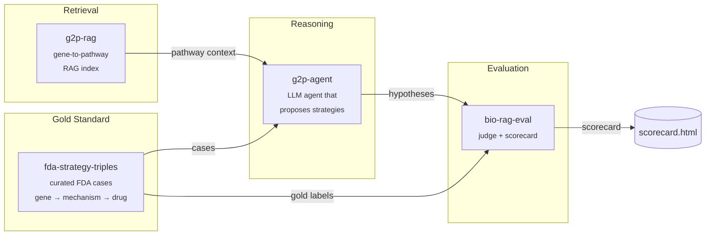

# therapy-stack

> An open-source stack for AI-driven therapeutic strategy hypothesis generation, with reproducible evaluation.

`therapy-stack` is the orchestration layer that composes four focused packages into a single end-to-end demo: given a disease gene with a known causal mechanism, it generates a ranked list of therapeutic strategy hypotheses and scores them against FDA-approved precedents.

Domain algorithms live in the four child repos. This repo holds the orchestration, the published docs, and a minimal end-to-end harness in [`sandbox/`](sandbox/) that runs the whole pipeline locally against real data with **no API keys required** — a free, open-source 3 B Llama model on CPU.

---

## Architecture



---

## Why four repos?

Each child repo solves one well-defined problem and is independently testable, citable, and installable. The split mirrors the natural boundaries of the system: a dataset (`fda-strategy-triples`), a retriever (`g2p-rag`), a reasoner (`g2p-agent`), and a judge (`bio-rag-eval`). Anyone can swap out a single component — a different retriever, a different judge model — without forking the whole stack. `therapy-stack` is the demo that proves the pieces fit together.

Child repos:

| Repo | What it does |
|---|---|
| [`fda-strategy-triples`](https://github.com/xX-its-amit-Xx/fda-strategy-triples) | Curated dataset of FDA-approved therapeutic strategies as (gene, mechanism, drug) triples — 10 cases, human-validated against ChEMBL/DrugBank/DailyMed |
| [`g2p-rag`](https://github.com/xX-its-amit-Xx/g2p-rag) | Hybrid dense+sparse retrieval over the Broad Institute G2P portal (UniProt + AlphaFold + ClinVar) |
| [`g2p-agent`](https://github.com/xX-its-amit-Xx/g2p-agent) | Claude tool-using agent that answers variant-level questions over the g2p-rag index |
| [`bio-rag-eval`](https://github.com/xX-its-amit-Xx/bio-rag-eval) | LLM-as-judge evaluation harness with deterministic + semantic scoring |

---

## Quickstart — run the real end-to-end demo locally

The runnable demo lives in [`sandbox/`](sandbox/). It uses a free, open-source 3 B Llama model loaded via `llama-cpp-python` — no API keys, no GPU required.

```powershell
git clone https://github.com/xX-its-amit-Xx/therapy-stack.git
cd therapy-stack/sandbox

# Python 3.11 venv (uv handles the install)
uv venv --python 3.11 .venv
$env:UV_CACHE_DIR = "C:/uv-cache"  # uv cache off the project drive

# Install runtime deps from abetlen's prebuilt CPU wheels
uv pip install --python ./.venv/Scripts/python.exe `
    llama-cpp-python `
    --extra-index-url https://abetlen.github.io/llama-cpp-python/whl/cpu
uv pip install --python ./.venv/Scripts/python.exe `
    huggingface_hub pandas pyarrow requests
uv pip install --python ./.venv/Scripts/python.exe `
    -e ../../fda-strategy-triples --no-deps

# Download Llama 3.2 3B Instruct Q4_K_M (~1.9 GB)
./.venv/Scripts/python.exe -c "from huggingface_hub import hf_hub_download; `
    hf_hub_download( `
      repo_id='bartowski/Llama-3.2-3B-Instruct-GGUF', `
      filename='Llama-3.2-3B-Instruct-Q4_K_M.gguf', `
      local_dir='C:/llama-models')"

# Run all 10 FDA cases end-to-end (~3 min on an 8-core CPU)
./.venv/Scripts/python.exe run_e2e.py --cases 10 --out results_all.json
```

For the Claude/Anthropic production path (requires `ANTHROPIC_API_KEY` and a built `g2p-rag` index), use the child packages directly — `g2p-agent` is wired to drive Claude end-to-end. The sandbox harness shows the same wiring without that infrastructure.

---

## Demos

| Path | Description |
|---|---|
| [`sandbox/run_e2e.py`](sandbox/run_e2e.py) | Working end-to-end on real FDA cases with a local Llama-3.2-3B model — no API key |
| [`sandbox/RESULTS.md`](sandbox/RESULTS.md) | Per-case agent traces and ranks from the most recent run |

---

## Latest scorecard

Real run, **2026-05-26**, Llama-3.2-3B-Instruct (Q4_K_M, llama-cpp-python, CPU), 10 cases from `fda-strategy-triples` v0.1.0. Full traces in [`sandbox/RESULTS.md`](sandbox/RESULTS.md).

| # | Drug | Disease gene(s) | Gold target | Top-1 prediction | Rank | Recovered |
|---|---|---|---|---|---|---|
| 1 | Spinraza | SMN1, SMN2 | SMN2 pre-mRNA ISS-N1 | `SMN2` | 1 | ✅ |
| 2 | Zolgensma | SMN1 | SMN1 transgene | `SMN1` | 1 | ✅ |
| 3 | Kalydeco | CFTR | CFTR | `CFTR` | 1 | ✅ |
| 4 | Galafold | GLA | GLA (lysosomal) | `GLA (mRNA)` | 1 | ✅ |
| 5 | Zokinvy | LMNA | FNTB (farnesyltransferase) | `SREBF1` | — | ❌ |
| 6 | Amvuttra | TTR | TTR mRNA | `STT3B` | — | ❌ |
| 7 | Givlaari | HMBS, CPOX, PPOX, ALAS1 | ALAS1 mRNA | `CPOX` | 2 | ✅ |
| 8 | Evrysdi | SMN1, SMN2 | SMN2 pre-mRNA splice site | `SMN1` | 2 | ✅ |
| 9 | Casgevy | BCL11A, HBB | BCL11A erythroid enhancer | `MTA2` | 3 | ✅ |
| 10 | Leqvio | PCSK9, LDLR | PCSK9 mRNA | `LDLR` | 2 | ✅ |

**Overall:** 8/10 recovered (gold target in top-3), top-1 hits 4/10, mean rank of correct target **1.625**, total wall time ~3 min.

### What the failures tell us

- **Zokinvy (LMNA → FNTB).** The retrieved UniProt PTM field *literally names* FNTA/FNTB as the farnesyltransferase, but the 3 B model fails to chain "progerin's CAAX motif is permanently farnesylated → that traps it at the membrane → block the transferase to release it" and defaults to "fix the nuclear envelope". A larger model or an explicit reasoning scaffold would likely close this.
- **Amvuttra (TTR → TTR mRNA).** The model over-reasons — proposes blocking glycosylation (STT3B) and RBP4 binding instead of just knocking down the toxic transthyretin. Sometimes "the disease gene IS the target" is the right answer; the prompt biases too hard against that.

---

## Cite this work

If you use `therapy-stack` or any of its components in your research, please cite the relevant child repo(s):

```bibtex
@software{shenoy_therapy_stack_2026,
  author  = {Shenoy, Amit},
  title   = {therapy-stack: An open-source orchestration layer for AI-driven therapeutic strategy generation},
  year    = {2026},
  url     = {https://github.com/xX-its-amit-Xx/therapy-stack},
  version = {0.1.0}
}

@software{shenoy_g2p_rag_2026,
  author  = {Shenoy, Amit},
  title   = {g2p-rag: Retrieval-augmented generation over the Broad Institute G2P portal},
  year    = {2026},
  url     = {https://github.com/xX-its-amit-Xx/g2p-rag},
  version = {0.1.0}
}

@software{shenoy_fda_strategy_triples_2026,
  author  = {Shenoy, Amit},
  title   = {fda-strategy-triples: A curated dataset of FDA-approved therapeutic strategies},
  year    = {2026},
  url     = {https://github.com/xX-its-amit-Xx/fda-strategy-triples},
  version = {0.1.0}
}

@software{shenoy_g2p_agent_2026,
  author  = {Shenoy, Amit},
  title   = {g2p-agent: A retrieval-augmented Claude agent over G2P portal data},
  year    = {2026},
  url     = {https://github.com/xX-its-amit-Xx/g2p-agent},
  version = {0.1.0}
}

@software{shenoy_bio_rag_eval_2026,
  author  = {Shenoy, Amit},
  title   = {bio-rag-eval: LLM-as-judge evaluation harness for biomedical RAG},
  year    = {2026},
  url     = {https://github.com/xX-its-amit-Xx/bio-rag-eval},
  version = {0.1.0}
}
```

---

## Roadmap

**v0.2.0 targets:**
- Expand the FDA case set from 10 → 30+ approvals, including more recent 2024–2025 entries
- Add a second LLM judge (GPT-4-class) to cross-check `bio-rag-eval` scores and report inter-judge agreement
- Expand pathway coverage in `g2p-rag` to include WikiPathways and a curated subset of SIGNOR
- Multi-step agent traces: let `therapy-agent` issue follow-up retrieval calls instead of one-shot reasoning
- A web UI for interactively browsing cases and scores, and the Claude-path scorecard side-by-side with the Llama-path scorecard

See [ARCHITECTURE.md](ARCHITECTURE.md) for a deeper component-by-component explanation.

---

## License

GNU General Public License v3.0 — see [LICENSE](LICENSE).
