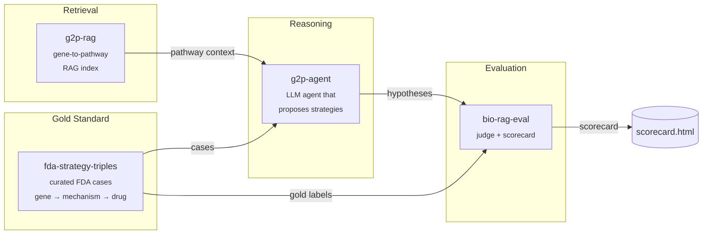

# therapy-stack

> An open-source stack for AI-driven therapeutic strategy hypothesis generation, with reproducible evaluation.

`therapy-stack` is the orchestration layer that composes four focused packages into a single end-to-end demo: given a disease gene with a known causal mechanism, it generates a ranked list of therapeutic strategy hypotheses and scores them against FDA-approved precedents.

Domain algorithms live in the four child repos. This repo holds the orchestration, the published docs, and a minimal end-to-end harness in [`sandbox/`](sandbox/) that runs the whole pipeline locally against real data with **no API keys required** — a free, open-source 3 B Llama model on CPU.

---

## Architecture



---

## Why four repos?

Each child repo solves one well-defined problem and is independently testable, citable, and installable. The split mirrors the natural boundaries of the system: a dataset (`fda-strategy-triples`), a retriever (`g2p-rag`), a reasoner (`g2p-agent`), and a judge (`bio-rag-eval`). Anyone can swap out a single component — a different retriever, a different judge model — without forking the whole stack. `therapy-stack` is the demo that proves the pieces fit together.

Child repos:

| Repo | What it does |
|---|---|
| [`fda-strategy-triples`](https://github.com/xX-its-amit-Xx/fda-strategy-triples) | Curated dataset of FDA-approved therapeutic strategies as (gene, mechanism, drug) triples — 10 cases, human-validated against ChEMBL/DrugBank/DailyMed |
| [`g2p-rag`](https://github.com/xX-its-amit-Xx/g2p-rag) | Hybrid dense+sparse retrieval over the Broad Institute G2P portal (UniProt + AlphaFold + ClinVar) |
| [`g2p-agent`](https://github.com/xX-its-amit-Xx/g2p-agent) | Claude tool-using agent that answers variant-level questions over the g2p-rag index |
| [`bio-rag-eval`](https://github.com/xX-its-amit-Xx/bio-rag-eval) | LLM-as-judge evaluation harness with deterministic + semantic scoring |

---

## Quickstart — run the real blinded benchmark locally

The runnable demo lives in [`sandbox/`](sandbox/). It drives the **real `therapy-agent` LangGraph pipeline** with a local Llama-3.2-3B model via `llama-cpp-python` — no API keys, no GPU required.

```powershell
git clone https://github.com/xX-its-amit-Xx/therapy-stack.git
cd therapy-stack/sandbox

# Python 3.11 venv (uv handles the install)
uv venv --python 3.11 .venv
$env:UV_CACHE_DIR = "C:/uv-cache"  # uv cache off the project drive

# Runtime deps from abetlen's prebuilt CPU wheels
uv pip install --python ./.venv/Scripts/python.exe `
    llama-cpp-python `
    --extra-index-url https://abetlen.github.io/llama-cpp-python/whl/cpu
uv pip install --python ./.venv/Scripts/python.exe `
    langgraph langchain-core httpx typer rich pydantic pyyaml `
    tenacity python-dotenv huggingface_hub pandas pyarrow requests
uv pip install --python ./.venv/Scripts/python.exe `
    -e ../../fda-strategy-triples --no-deps `
    -e ../../therapy-agent --no-deps

# Download Llama 3.2 3B Instruct Q4_K_M (~1.9 GB)
./.venv/Scripts/python.exe -c "from huggingface_hub import hf_hub_download; `
    hf_hub_download( `
      repo_id='bartowski/Llama-3.2-3B-Instruct-GGUF', `
      filename='Llama-3.2-3B-Instruct-Q4_K_M.gguf', `
      local_dir='C:/llama-models')"

# Blinded run: 10 YAML benchmark cases through the real therapy-agent
$env:THERAPY_AGENT_LLM_BACKEND = "llama"
./.venv/Scripts/python.exe run_blinded.py --out blinded_results.json
```

To run the Claude path instead, set `ANTHROPIC_API_KEY` and `THERAPY_AGENT_LLM_BACKEND=anthropic`. The prompts and tooling are identical.

---

## Demos

| Path | Description |
|---|---|
| [`sandbox/run_e2e.py`](sandbox/run_e2e.py) | Working end-to-end on real FDA cases with a local Llama-3.2-3B model — no API key |
| [`sandbox/RESULTS.md`](sandbox/RESULTS.md) | Per-case agent traces and ranks from the most recent run |

---

## Latest scorecard — dev / val / frontier / tool-use comparison

Four configurations now sit on the same dev/val split. Same prompts, same retrieval substrate, same scoring. Per-case detail in [`sandbox/RESULTS_FRONTIER.md`](sandbox/RESULTS_FRONTIER.md).

| Backend | Set | Target | Hard | Easy | Wall | Cost |
|---|---|---|---|---|---|---|
| R1-Distill 8B (local CPU) | dev | 13/16 | 6/8 | 7/8 | 127 min | ~$0 |
| R1-Distill 8B (local CPU) | val | 3/6 | 0/3 | 3/3 | 46 min | ~$0 |
| GPT-4o (no tool-use) | dev | 16/16 | 8/8 | 8/8 | 4 min | $0.06 |
| GPT-4o (no tool-use) | val | 2/6 | 0/3 | 2/3 | 1 min | $0.03 |
| GPT-4o + **tool-use loop** | dev | 15/16 | 7/8 | 8/8 | 6 min | $0.06 |
| **GPT-4o + tool-use loop** | **val** | **4/6** | **1/3** | **3/3** | **2 min** | **$0.03** |

**Baselines (no LLM):** disease-gene 9/16 dev, 3/6 val.

### The tool-use win

Adding a ReAct-style agentic loop — same model, same dev/val cases — **doubled val recovery (2/6 → 4/6)** and recovered one hard case (0/3 → 1/3). The pipeline change was bigger than the model change.

The new node `agentic_target_research` lives between `interactor_biology_lookup` and `strategy_synthesis`. The LLM can issue up to 4 follow-up retrieval calls via three tools:
- **`expand_pathway(gene)`** — returns Reactome interactors + pathway role.
- **`query_biology(gene)`** — returns UniProt FUNCTION / PATHWAY / SUBUNIT / PTM.
- **`find_hormonal_axis(disease_phenotype)`** — deterministic heuristic mapping endocrine phenotypes to their feedback loops (HPA, HPT, HPG axes).

Two val cases recovered by genuine multi-step reasoning:

- **Garadacimab HAE: KLKB1 → F12 (hard).** Without tools, GPT-4o copied the Ekterly mapping (KLKB1) into the novel Garadacimab case. With tools, it called `expand_pathway(SERPING1)` → got `[KLKB1, F12, BDKRB2, ...]`, then queried both KLKB1 and F12 biology, read F12's UniProt FUNCTION (`"initiator of blood coagulation, fibrinolysis..."`), and concluded F12 is the upstream protease. Real cascade disambiguation.
- **Resmetirom MASH: RXRA → THRB (easy).** Without tools, the model picked RXRA (THRB's heterodimer partner — adjacent biology). With tools the agent queried THRB biology and confirmed THRB itself as the FDA target.

Near-miss: **Crinecerfont CAH** — agent identified the HPA axis correctly via `find_hormonal_axis`, but the axis hint surfaces both CRHR1 and MC2R; the model picked MC2R (ACTH receptor on the adrenal) instead of CRHR1 (CRH receptor on the pituitary, the actual Crinecerfont target). 50/50 between two correct-axis receptors.

Still missing: **Sotatercept PAH** — disease gene (BMPR2) picked instead of ACVR2A. The agentic loop didn't surface the activin-trap mechanism. Would need a dedicated tool for ligand-trap modalities.

### What this means

**GPT-4o + tool-use is the configuration that decisively beats the disease-gene baseline on val (4/6 vs 3/6).** The frontier model alone (2/6) couldn't do it. The open-weight reasoning model alone (3/6) couldn't do it. Tool-use is the unlock.

Cost-wise, the entire dev + val sweep with GPT-4o + tool-use costs ~$0.09 and takes 8 minutes wall-clock. Cheaper and faster than the R1-Distill local CPU pass that scored worse on val.

### Next investments (post tool-use)

1. **Self-consistency on tool calls** — re-issue Crinecerfont 3× with majority vote on the final target. Would resolve the CRHR1/MC2R coin-flip.
2. **`find_ligand_trap_family` tool** — close Sotatercept by surfacing the ActRIIA-Fc activin-trap mechanism.
3. **Expand val to 15-20 cases** — Wilson CI on 4/6 is 30-90%; need bigger N for the number to be measurement-grade.
4. **R1-Distill + tool-use comparison** — does the open-weight reasoning model close val with the agentic loop? Two-hour local run, no API cost.

### Production layer (unchanged)

- [`baselines.json`](baselines.json), [`scripts/regression_check.py`](scripts/regression_check.py), [`.github/workflows/benchmark.yml`](.github/workflows/benchmark.yml), [`RUNBOOK.md`](RUNBOOK.md).
- `run_blinded.py` emits per-case `tokens_in_total` / `tokens_out_total` / `llm_calls_per_node` for cost/latency budgets.

---

## Cite this work

If you use `therapy-stack` or any of its components in your research, please cite the relevant child repo(s):

```bibtex
@software{shenoy_therapy_stack_2026,
  author  = {Shenoy, Amit},
  title   = {therapy-stack: An open-source orchestration layer for AI-driven therapeutic strategy generation},
  year    = {2026},
  url     = {https://github.com/xX-its-amit-Xx/therapy-stack},
  version = {0.1.0}
}

@software{shenoy_g2p_rag_2026,
  author  = {Shenoy, Amit},
  title   = {g2p-rag: Retrieval-augmented generation over the Broad Institute G2P portal},
  year    = {2026},
  url     = {https://github.com/xX-its-amit-Xx/g2p-rag},
  version = {0.1.0}
}

@software{shenoy_fda_strategy_triples_2026,
  author  = {Shenoy, Amit},
  title   = {fda-strategy-triples: A curated dataset of FDA-approved therapeutic strategies},
  year    = {2026},
  url     = {https://github.com/xX-its-amit-Xx/fda-strategy-triples},
  version = {0.1.0}
}

@software{shenoy_g2p_agent_2026,
  author  = {Shenoy, Amit},
  title   = {g2p-agent: A retrieval-augmented Claude agent over G2P portal data},
  year    = {2026},
  url     = {https://github.com/xX-its-amit-Xx/g2p-agent},
  version = {0.1.0}
}

@software{shenoy_bio_rag_eval_2026,
  author  = {Shenoy, Amit},
  title   = {bio-rag-eval: LLM-as-judge evaluation harness for biomedical RAG},
  year    = {2026},
  url     = {https://github.com/xX-its-amit-Xx/bio-rag-eval},
  version = {0.1.0}
}
```

---

## Roadmap

**v0.2.0 targets:**
- Expand the FDA case set from 10 → 30+ approvals, including more recent 2024–2025 entries
- Add a second LLM judge (GPT-4-class) to cross-check `bio-rag-eval` scores and report inter-judge agreement
- Expand pathway coverage in `g2p-rag` to include WikiPathways and a curated subset of SIGNOR
- Multi-step agent traces: let `therapy-agent` issue follow-up retrieval calls instead of one-shot reasoning
- A web UI for interactively browsing cases and scores, and the Claude-path scorecard side-by-side with the Llama-path scorecard

See [ARCHITECTURE.md](ARCHITECTURE.md) for a deeper component-by-component explanation.

---

## License

GNU General Public License v3.0 — see [LICENSE](LICENSE).
