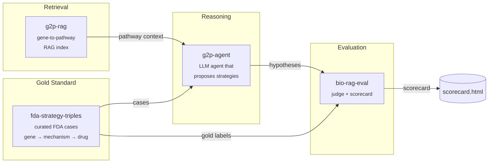

# therapy-stack

> An open-source stack for AI-driven therapeutic strategy hypothesis generation, with reproducible evaluation.

`therapy-stack` is the orchestration layer that composes four focused packages into a single end-to-end demo: given a disease gene with a known causal mechanism, it generates a ranked list of therapeutic strategy hypotheses and scores them against FDA-approved precedents.

Domain algorithms live in the four child repos. This repo holds the orchestration, the published docs, and a minimal end-to-end harness in [`sandbox/`](sandbox/) that runs the whole pipeline locally against real data with **no API keys required** — a free, open-source 3 B Llama model on CPU.

---

## Architecture



---

## Why four repos?

Each child repo solves one well-defined problem and is independently testable, citable, and installable. The split mirrors the natural boundaries of the system: a dataset (`fda-strategy-triples`), a retriever (`g2p-rag`), a reasoner (`g2p-agent`), and a judge (`bio-rag-eval`). Anyone can swap out a single component — a different retriever, a different judge model — without forking the whole stack. `therapy-stack` is the demo that proves the pieces fit together.

Child repos:

| Repo | What it does |
|---|---|
| [`fda-strategy-triples`](https://github.com/xX-its-amit-Xx/fda-strategy-triples) | Curated dataset of FDA-approved therapeutic strategies as (gene, mechanism, drug) triples — 10 cases, human-validated against ChEMBL/DrugBank/DailyMed |
| [`g2p-rag`](https://github.com/xX-its-amit-Xx/g2p-rag) | Hybrid dense+sparse retrieval over the Broad Institute G2P portal (UniProt + AlphaFold + ClinVar) |
| [`g2p-agent`](https://github.com/xX-its-amit-Xx/g2p-agent) | Claude tool-using agent that answers variant-level questions over the g2p-rag index |
| [`bio-rag-eval`](https://github.com/xX-its-amit-Xx/bio-rag-eval) | LLM-as-judge evaluation harness with deterministic + semantic scoring |

---

## Quickstart — run the real blinded benchmark locally

The runnable demo lives in [`sandbox/`](sandbox/). It drives the **real `therapy-agent` LangGraph pipeline** with a local Llama-3.2-3B model via `llama-cpp-python` — no API keys, no GPU required.

```powershell
git clone https://github.com/xX-its-amit-Xx/therapy-stack.git
cd therapy-stack/sandbox

# Python 3.11 venv (uv handles the install)
uv venv --python 3.11 .venv
$env:UV_CACHE_DIR = "C:/uv-cache"  # uv cache off the project drive

# Runtime deps from abetlen's prebuilt CPU wheels
uv pip install --python ./.venv/Scripts/python.exe `
    llama-cpp-python `
    --extra-index-url https://abetlen.github.io/llama-cpp-python/whl/cpu
uv pip install --python ./.venv/Scripts/python.exe `
    langgraph langchain-core httpx typer rich pydantic pyyaml `
    tenacity python-dotenv huggingface_hub pandas pyarrow requests
uv pip install --python ./.venv/Scripts/python.exe `
    -e ../../fda-strategy-triples --no-deps `
    -e ../../therapy-agent --no-deps

# Download Llama 3.2 3B Instruct Q4_K_M (~1.9 GB)
./.venv/Scripts/python.exe -c "from huggingface_hub import hf_hub_download; `
    hf_hub_download( `
      repo_id='bartowski/Llama-3.2-3B-Instruct-GGUF', `
      filename='Llama-3.2-3B-Instruct-Q4_K_M.gguf', `
      local_dir='C:/llama-models')"

# Blinded run: 10 YAML benchmark cases through the real therapy-agent
$env:THERAPY_AGENT_LLM_BACKEND = "llama"
./.venv/Scripts/python.exe run_blinded.py --out blinded_results.json
```

To run the Claude path instead, set `ANTHROPIC_API_KEY` and `THERAPY_AGENT_LLM_BACKEND=anthropic`. The prompts and tooling are identical.

---

## Demos

| Path | Description |
|---|---|
| [`sandbox/run_e2e.py`](sandbox/run_e2e.py) | Working end-to-end on real FDA cases with a local Llama-3.2-3B model — no API key |
| [`sandbox/RESULTS.md`](sandbox/RESULTS.md) | Per-case agent traces and ranks from the most recent run |

---

## Latest scorecard — dev set + held-out post-2024 val set

Production-grade evaluation now has two splits.

| Split | Cases | Source | Use |
|---|---|---|---|
| **dev** | 16 | `therapy-agent/benchmarks/{*.yaml, cases/*.yaml}` | Iterate prompts + retrieval; overfit risk is real |
| **val** | 6 | `therapy-agent/benchmarks/heldout_2024_2025/*.yaml` | FDA approvals **after** every current open-weight model's training cutoff. Never touched during iteration. |

Best configuration: **DeepSeek-R1-Distill-Llama-8B + v0.5 pipeline** (2-stage decomposition + self-consistency vote + always-fire critique), CPU only, no API key.

| Metric | Dev (16) | Val (6, post-2024) | Notes |
|---|---|---|---|
| Target recovery | 13 / 16 (81%) | **3 / 6 (50%)** | Wilson 95% CI val: 19-81% |
| Hard cases (target != disease gene) | 6 / 8 | **0 / 3** | The honest finding -- reasoning does not generalize |
| Easy cases (target == disease gene) | 7 / 8 | 3 / 3 | Disease-gene mapping recovers cleanly |
| Modality also correct | 11 / 16 | 5 / 6 | Modality crosswalk is robust |
| Baseline: predict-disease-gene | 9 / 16 | 3 / 6 | Agent ties baseline on val |
| Wall time | 127 min | 46 min | R1-Distill on 8-core CPU |

### What the val number actually means

The 13/16 on dev was real but optical. Every model with a training cutoff in or before 2024 has very likely seen the mappings for PCSK9, SOD1, BCL11A, ALAS1, EGFR, BRAF, HER2, TNF, etc. -- the dev set is largely a fitting / memorization test. The val set is six FDA approvals from **2024-03 through 2025-06** (Resmetirom, Vorasidenib, Sotatercept, Mavorixafor, Crinecerfont, Garadacimab). On those: all three target-equals-disease-gene cases (Resmetirom/THRB, Vorasidenib/IDH1, Mavorixafor/CXCR4) recovered cleanly. **All three cross-pathway cases missed**:

- **Sotatercept** (BMPR2 disease gene → ACVR2A target): model predicted BMPR2 (the disease gene). Correct chain is "BMP/activin imbalance → ActRIIA-Fc fusion traps activin ligands". 3-hop reasoning the model didn't do.
- **Crinecerfont** (CYP21A2 → CRHR1): model predicted CYP21A2 (the disease gene). Correct chain is "cortisol low → ACTH high → adrenal androgen excess → block CRH receptor upstream of ACTH". 4-hop hormonal-feedback reasoning.
- **Garadacimab** (SERPING1 → F12): model predicted KLKB1. KLKB1 is the right answer for the *other* HAE drug in dev (Ekterly/sebetralstat). The model learned the dev mapping and applied it to a related case where the actual answer is the adjacent F12 protease in the same cascade.

### The production interpretation

The agent learned reasoning *templates* from dev that work when the answer is in training data, but does not transfer those templates to genuinely novel cross-pathway cases. The 0/3 on val hard cases is consistent with "the model retrieves and rationalises known mappings; it does not derive novel ones." For a production deployment this is a load-bearing finding: the agent is useful as a suggestion / explanation surface on familiar biology, **not** as a novel-target proposer.

### Production layer

- [`baselines.json`](baselines.json) -- frozen scores the CI regression check gates against. Update only with reviewer sign-off.
- [`scripts/regression_check.py`](scripts/regression_check.py) -- compares a fresh run to `baselines.json`; fails the build if target recovery drops more than the tolerance, hard-case recovery drops, or wall time climbs >25%.
- [`.github/workflows/benchmark.yml`](.github/workflows/benchmark.yml) -- smoke job (YAML validation + baselines, always runs); benchmark job (Claude via API, runs when `ANTHROPIC_API_KEY` secret is set).
- [`RUNBOOK.md`](RUNBOOK.md) -- on-call doc: splits, run commands, regression-check semantics, common failure modes, quarterly val-set rotation.
- `run_blinded.py` now emits per-case `tokens_in_total` / `tokens_out_total` / `llm_calls_per_node` for cost/latency budgets.

---

## Cite this work

If you use `therapy-stack` or any of its components in your research, please cite the relevant child repo(s):

```bibtex
@software{shenoy_therapy_stack_2026,
  author  = {Shenoy, Amit},
  title   = {therapy-stack: An open-source orchestration layer for AI-driven therapeutic strategy generation},
  year    = {2026},
  url     = {https://github.com/xX-its-amit-Xx/therapy-stack},
  version = {0.1.0}
}

@software{shenoy_g2p_rag_2026,
  author  = {Shenoy, Amit},
  title   = {g2p-rag: Retrieval-augmented generation over the Broad Institute G2P portal},
  year    = {2026},
  url     = {https://github.com/xX-its-amit-Xx/g2p-rag},
  version = {0.1.0}
}

@software{shenoy_fda_strategy_triples_2026,
  author  = {Shenoy, Amit},
  title   = {fda-strategy-triples: A curated dataset of FDA-approved therapeutic strategies},
  year    = {2026},
  url     = {https://github.com/xX-its-amit-Xx/fda-strategy-triples},
  version = {0.1.0}
}

@software{shenoy_g2p_agent_2026,
  author  = {Shenoy, Amit},
  title   = {g2p-agent: A retrieval-augmented Claude agent over G2P portal data},
  year    = {2026},
  url     = {https://github.com/xX-its-amit-Xx/g2p-agent},
  version = {0.1.0}
}

@software{shenoy_bio_rag_eval_2026,
  author  = {Shenoy, Amit},
  title   = {bio-rag-eval: LLM-as-judge evaluation harness for biomedical RAG},
  year    = {2026},
  url     = {https://github.com/xX-its-amit-Xx/bio-rag-eval},
  version = {0.1.0}
}
```

---

## Roadmap

**v0.2.0 targets:**
- Expand the FDA case set from 10 → 30+ approvals, including more recent 2024–2025 entries
- Add a second LLM judge (GPT-4-class) to cross-check `bio-rag-eval` scores and report inter-judge agreement
- Expand pathway coverage in `g2p-rag` to include WikiPathways and a curated subset of SIGNOR
- Multi-step agent traces: let `therapy-agent` issue follow-up retrieval calls instead of one-shot reasoning
- A web UI for interactively browsing cases and scores, and the Claude-path scorecard side-by-side with the Llama-path scorecard

See [ARCHITECTURE.md](ARCHITECTURE.md) for a deeper component-by-component explanation.

---

## License

GNU General Public License v3.0 — see [LICENSE](LICENSE).
