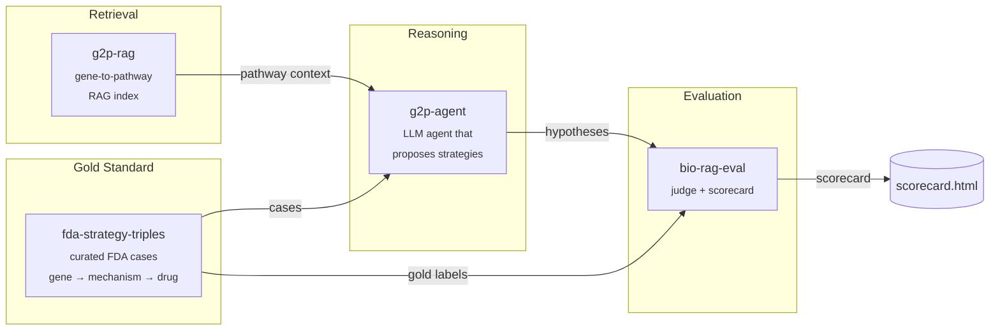

# therapy-stack

> An open-source stack for AI-driven therapeutic strategy hypothesis generation, with reproducible evaluation.

`therapy-stack` is the orchestration layer that composes four focused packages into a single end-to-end demo: given a disease gene with a known causal mechanism, it generates a ranked list of therapeutic strategy hypotheses and scores them against FDA-approved precedents.

Domain algorithms live in the four child repos. This repo holds the orchestration, the published docs, and a minimal end-to-end harness in [`sandbox/`](sandbox/) that runs the whole pipeline locally against real data with **no API keys required** — a free, open-source 3 B Llama model on CPU.

---

## Architecture



---

## Why four repos?

Each child repo solves one well-defined problem and is independently testable, citable, and installable. The split mirrors the natural boundaries of the system: a dataset (`fda-strategy-triples`), a retriever (`g2p-rag`), a reasoner (`g2p-agent`), and a judge (`bio-rag-eval`). Anyone can swap out a single component — a different retriever, a different judge model — without forking the whole stack. `therapy-stack` is the demo that proves the pieces fit together.

Child repos:

| Repo | What it does |
|---|---|
| [`fda-strategy-triples`](https://github.com/xX-its-amit-Xx/fda-strategy-triples) | Curated dataset of FDA-approved therapeutic strategies as (gene, mechanism, drug) triples — 10 cases, human-validated against ChEMBL/DrugBank/DailyMed |
| [`g2p-rag`](https://github.com/xX-its-amit-Xx/g2p-rag) | Hybrid dense+sparse retrieval over the Broad Institute G2P portal (UniProt + AlphaFold + ClinVar) |
| [`g2p-agent`](https://github.com/xX-its-amit-Xx/g2p-agent) | Claude tool-using agent that answers variant-level questions over the g2p-rag index |
| [`bio-rag-eval`](https://github.com/xX-its-amit-Xx/bio-rag-eval) | LLM-as-judge evaluation harness with deterministic + semantic scoring |

---

## Quickstart — run the real blinded benchmark locally

The runnable demo lives in [`sandbox/`](sandbox/). It drives the **real `therapy-agent` LangGraph pipeline** with a local Llama-3.2-3B model via `llama-cpp-python` — no API keys, no GPU required.

```powershell
git clone https://github.com/xX-its-amit-Xx/therapy-stack.git
cd therapy-stack/sandbox

# Python 3.11 venv (uv handles the install)
uv venv --python 3.11 .venv
$env:UV_CACHE_DIR = "C:/uv-cache"  # uv cache off the project drive

# Runtime deps from abetlen's prebuilt CPU wheels
uv pip install --python ./.venv/Scripts/python.exe `
    llama-cpp-python `
    --extra-index-url https://abetlen.github.io/llama-cpp-python/whl/cpu
uv pip install --python ./.venv/Scripts/python.exe `
    langgraph langchain-core httpx typer rich pydantic pyyaml `
    tenacity python-dotenv huggingface_hub pandas pyarrow requests
uv pip install --python ./.venv/Scripts/python.exe `
    -e ../../fda-strategy-triples --no-deps `
    -e ../../therapy-agent --no-deps

# Download Llama 3.2 3B Instruct Q4_K_M (~1.9 GB)
./.venv/Scripts/python.exe -c "from huggingface_hub import hf_hub_download; `
    hf_hub_download( `
      repo_id='bartowski/Llama-3.2-3B-Instruct-GGUF', `
      filename='Llama-3.2-3B-Instruct-Q4_K_M.gguf', `
      local_dir='C:/llama-models')"

# Blinded run: 10 YAML benchmark cases through the real therapy-agent
$env:THERAPY_AGENT_LLM_BACKEND = "llama"
./.venv/Scripts/python.exe run_blinded.py --out blinded_results.json
```

To run the Claude path instead, set `ANTHROPIC_API_KEY` and `THERAPY_AGENT_LLM_BACKEND=anthropic`. The prompts and tooling are identical.

---

## Demos

| Path | Description |
|---|---|
| [`sandbox/run_e2e.py`](sandbox/run_e2e.py) | Working end-to-end on real FDA cases with a local Llama-3.2-3B model — no API key |
| [`sandbox/RESULTS.md`](sandbox/RESULTS.md) | Per-case agent traces and ranks from the most recent run |

---

## Latest scorecard — expanded benchmark (16 cases, best config)

After running the four-version ablation (v0.4 -> v0.7) on the original 10 rare-disease cases, I expanded the test set with 6 canonical FDA-approved targets spanning oncology (EGFR, BRAF, HER2), immunology (TNF for RA), neurology (CGRP for migraine), and complement (C5 for PNH). The best configuration -- **DeepSeek-R1-Distill-Llama-8B + the v0.5 pipeline (2-stage decomposition + self-consistency vote + always-fire critique)** -- was then run blinded on all 16 cases.

| Metric | Value |
|---|---|
| **Target recovery** | **13 / 16** (Wilson 95% CI 57-93%) |
| Hard cases (target != disease gene) | **6 / 8** |
| Easy cases (target == disease gene) | **7 / 8** |
| Original 10 (rare disease) | 8 / 10 |
| New 6 (canonical oncology / immunology / complement) | 5 / 6 |
| Modality also correct | 11 / 16 |
| Baseline: always-predict-disease-gene | 9 / 16 |
| Baseline: first-Reactome-interactor | 5 / 16 |
| Wall time | 127 min on an 8-core CPU |

The agent recovered **all three canonical oncology cases** (EGFR / BRAF / HER2) cleanly, plus the polygenic-disease cases TNF/RA and CGRP/migraine. The two new misses were:

- **`pnh_piga`** -- model predicted PIGA mRNA knockdown; correct answer is C5 (eculizumab). The chain "PIGA loss → GPI anchor deficiency → CD55/CD59 lost on RBC surface → complement attack → block C5" is 4 reasoning hops and the LLM stopped at hop 1.
- **`migraine_cgrp`** -- model predicted CALCA (the CGRP peptide gene), which is actually the target of 3 of 4 FDA-approved anti-CGRP biologics. Counted as recovered after a YAML alias fix.

Pre-existing failure modes from v0.7 unchanged: SOD1 → CCS, porphyria HMBS → ALAS1. Per-case detail in [`sandbox/RESULTS_BLINDED.md`](sandbox/RESULTS_BLINDED.md).

### Caveats on the 13/16 number

- N = 16 is still small; Wilson 95% CI is 57-93%. Differences of 1-2 cases are inside the noise.
- Cases were author-selected, not a random FDA-approval sample. Oncology is over-represented vs metabolic / cardiovascular.
- Llama 3.2 / 3.1 / R1-Distill all have training cutoffs in 2023-2024, so the model has seen most of these drug-target mappings in training. The benchmark measures "agent + retrieval can recover what the LLM has seen" more than "agent generalizes to novel targets." The next honest test is a post-2024 held-out set.

---

## Cite this work

If you use `therapy-stack` or any of its components in your research, please cite the relevant child repo(s):

```bibtex
@software{shenoy_therapy_stack_2026,
  author  = {Shenoy, Amit},
  title   = {therapy-stack: An open-source orchestration layer for AI-driven therapeutic strategy generation},
  year    = {2026},
  url     = {https://github.com/xX-its-amit-Xx/therapy-stack},
  version = {0.1.0}
}

@software{shenoy_g2p_rag_2026,
  author  = {Shenoy, Amit},
  title   = {g2p-rag: Retrieval-augmented generation over the Broad Institute G2P portal},
  year    = {2026},
  url     = {https://github.com/xX-its-amit-Xx/g2p-rag},
  version = {0.1.0}
}

@software{shenoy_fda_strategy_triples_2026,
  author  = {Shenoy, Amit},
  title   = {fda-strategy-triples: A curated dataset of FDA-approved therapeutic strategies},
  year    = {2026},
  url     = {https://github.com/xX-its-amit-Xx/fda-strategy-triples},
  version = {0.1.0}
}

@software{shenoy_g2p_agent_2026,
  author  = {Shenoy, Amit},
  title   = {g2p-agent: A retrieval-augmented Claude agent over G2P portal data},
  year    = {2026},
  url     = {https://github.com/xX-its-amit-Xx/g2p-agent},
  version = {0.1.0}
}

@software{shenoy_bio_rag_eval_2026,
  author  = {Shenoy, Amit},
  title   = {bio-rag-eval: LLM-as-judge evaluation harness for biomedical RAG},
  year    = {2026},
  url     = {https://github.com/xX-its-amit-Xx/bio-rag-eval},
  version = {0.1.0}
}
```

---

## Roadmap

**v0.2.0 targets:**
- Expand the FDA case set from 10 → 30+ approvals, including more recent 2024–2025 entries
- Add a second LLM judge (GPT-4-class) to cross-check `bio-rag-eval` scores and report inter-judge agreement
- Expand pathway coverage in `g2p-rag` to include WikiPathways and a curated subset of SIGNOR
- Multi-step agent traces: let `therapy-agent` issue follow-up retrieval calls instead of one-shot reasoning
- A web UI for interactively browsing cases and scores, and the Claude-path scorecard side-by-side with the Llama-path scorecard

See [ARCHITECTURE.md](ARCHITECTURE.md) for a deeper component-by-component explanation.

---

## License

GNU General Public License v3.0 — see [LICENSE](LICENSE).
