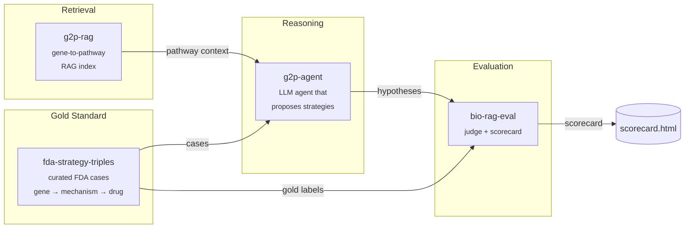

# therapy-stack

> An open-source stack for AI-driven therapeutic strategy hypothesis generation, with reproducible evaluation.

`therapy-stack` is the orchestration layer that composes four focused packages into a single end-to-end demo: given a disease gene with a known causal mechanism, it generates a ranked list of therapeutic strategy hypotheses and scores them against FDA-approved precedents.

Domain algorithms live in the four child repos. This repo holds the orchestration, the published docs, and a minimal end-to-end harness in [`sandbox/`](sandbox/) that runs the whole pipeline locally against real data with **no API keys required** — a free, open-source 3 B Llama model on CPU.

---

## Architecture



---

## Why four repos?

Each child repo solves one well-defined problem and is independently testable, citable, and installable. The split mirrors the natural boundaries of the system: a dataset (`fda-strategy-triples`), a retriever (`g2p-rag`), a reasoner (`g2p-agent`), and a judge (`bio-rag-eval`). Anyone can swap out a single component — a different retriever, a different judge model — without forking the whole stack. `therapy-stack` is the demo that proves the pieces fit together.

Child repos:

| Repo | What it does |
|---|---|
| [`fda-strategy-triples`](https://github.com/xX-its-amit-Xx/fda-strategy-triples) | Curated dataset of FDA-approved therapeutic strategies as (gene, mechanism, drug) triples — 10 cases, human-validated against ChEMBL/DrugBank/DailyMed |
| [`g2p-rag`](https://github.com/xX-its-amit-Xx/g2p-rag) | Hybrid dense+sparse retrieval over the Broad Institute G2P portal (UniProt + AlphaFold + ClinVar) |
| [`g2p-agent`](https://github.com/xX-its-amit-Xx/g2p-agent) | Claude tool-using agent that answers variant-level questions over the g2p-rag index |
| [`bio-rag-eval`](https://github.com/xX-its-amit-Xx/bio-rag-eval) | LLM-as-judge evaluation harness with deterministic + semantic scoring |

---

## Quickstart — run the real blinded benchmark locally

The runnable demo lives in [`sandbox/`](sandbox/). It drives the **real `therapy-agent` LangGraph pipeline** with a local Llama-3.2-3B model via `llama-cpp-python` — no API keys, no GPU required.

```powershell
git clone https://github.com/xX-its-amit-Xx/therapy-stack.git
cd therapy-stack/sandbox

# Python 3.11 venv (uv handles the install)
uv venv --python 3.11 .venv
$env:UV_CACHE_DIR = "C:/uv-cache"  # uv cache off the project drive

# Runtime deps from abetlen's prebuilt CPU wheels
uv pip install --python ./.venv/Scripts/python.exe `
    llama-cpp-python `
    --extra-index-url https://abetlen.github.io/llama-cpp-python/whl/cpu
uv pip install --python ./.venv/Scripts/python.exe `
    langgraph langchain-core httpx typer rich pydantic pyyaml `
    tenacity python-dotenv huggingface_hub pandas pyarrow requests
uv pip install --python ./.venv/Scripts/python.exe `
    -e ../../fda-strategy-triples --no-deps `
    -e ../../therapy-agent --no-deps

# Download Llama 3.2 3B Instruct Q4_K_M (~1.9 GB)
./.venv/Scripts/python.exe -c "from huggingface_hub import hf_hub_download; `
    hf_hub_download( `
      repo_id='bartowski/Llama-3.2-3B-Instruct-GGUF', `
      filename='Llama-3.2-3B-Instruct-Q4_K_M.gguf', `
      local_dir='C:/llama-models')"

# Blinded run: 10 YAML benchmark cases through the real therapy-agent
$env:THERAPY_AGENT_LLM_BACKEND = "llama"
./.venv/Scripts/python.exe run_blinded.py --out blinded_results.json
```

To run the Claude path instead, set `ANTHROPIC_API_KEY` and `THERAPY_AGENT_LLM_BACKEND=anthropic`. The prompts and tooling are identical.

---

## Demos

| Path | Description |
|---|---|
| [`sandbox/run_e2e.py`](sandbox/run_e2e.py) | Working end-to-end on real FDA cases with a local Llama-3.2-3B model — no API key |
| [`sandbox/RESULTS.md`](sandbox/RESULTS.md) | Per-case agent traces and ranks from the most recent run |

---

## Latest scorecard — v0.8 (R1-Distill local, expanded val) + v0.9.x guards

The current best fully-open-weight result on a 12-case val split (post-2024 NMEs, all post-pretraining-cutoff for R1-Distill 8B):

| Backend | Split | Target | Wall | Cost |
|---|---|---|---|---|
| R1-Distill 8B local | dev | 12/16 (75%) | 127 min | $0 |
| R1-Distill 8B local | val | **9/12 (75%)** | 99 min | $0 |
| R1-Distill 8B local | adversarial | 1/4 (25%) | 40 min | $0 |
| GPT-4o + ReAct + SC3 | dev | 15/16 (94%) | 6 min | $0.06 |
| GPT-4o + ReAct + SC3 | val (6-case subset) | 4/6 (67%) | 4 min | $0.03 |

**Caveats:** N is small (Wilson 95% CI on 9/12 val is 46–91%). The GPT-4o val number is on the original 6 cases; R1-Distill ran on the expanded 12. See [honest limitations](#honest-limitations-the-hidden-curriculum) and [`sandbox/COST_FRONTIER.md`](sandbox/COST_FRONTIER.md) for the full split-stratified comparison.

**v0.9.x strategy guards added (this round):** v0.9 disease_gene_default guard; v0.9.2b unconditional feedback-axis override (pattern 9, fires on phenotype markers like "ACTH-driven"); v0.9.3 mechanism-pattern guard (LoF + disease_gene_mRNA → downstream_effector); v0.9.4 picker prompt rule for feedback_axis_receptor. Smoke verifies Crinecerfont moved off disease-gene-default (`disease_gene_default_rate` 100% → 0%) — predicted NR3C1 instead of CYP21A2; correct pattern category, wrong specific receptor. See [`CHANGELOG.md`](CHANGELOG.md) for the lever-by-lever lift.

**v0.10 (this round): g2p-rag actually wired in.** Prior versions claimed `g2p-rag` retrieval in the architecture but every call ImportError'd and fell back to UniProt-direct (wrong import path + wrong constructor in `g2p_tool.py`, plus upstream G2P portal had retired the endpoints `g2p-rag` was hitting). Fixed both. ChromaDB index of all 47 benchmark genes is now built (684 chunks across domain / variant_cluster / protein_summary). Every `variant_lookup_node` call now returns `source='g2p-rag (package)'` with gene-filtered chunks. The "UniProt fallback" only fires now when the index is genuinely unavailable. See [`g2p-rag@a2e2d27`](https://github.com/xX-its-amit-Xx/g2p-rag/commit/a2e2d27) for the upstream API adapter and the therapy-agent commit for the wiring fix.

**v0.11 (this round): first measurable g2p-rag improvement.** Re-ingested all 47 benchmark genes with the v0.1.1 enriched chunker (`function` / `pathway` / `subunit` / `disease` chunk types added; +135 chunks vs prior). Crinecerfont single-case re-test predicted **CRHR1** (target_recovered=true, confidence 0.75) — the first time the FDA target has been hit on this case across the arc. Trajectory across versions: CYP21A2 (v0.9 baseline) → NR3C1 (v0.9.2b) → MC2R (v0.9.4) → **CRHR1** (v0.11, recovered). The rationale shows the new chunks landing: explicit HPA-axis pathway language ("upstream receptor in the hypothalamic-pituitary-adrenal (HPA) axis that senses and responds to ACTH levels", "feedback loop by driving the compensatory mechanisms") that maps to UniProt PATHWAY / FUNCTION chunks, and the reasoning_trace now reports `g2p-rag: retrieved 5 chunk(s) via g2p-rag (package)` vs `3 chunk(s) via g2p-rag UniProt fallback` in v0.9.4. Full val pass impact is TBD; this single case is the proof-of-concept that the richer biology resolves the v0.9.x Stage-2 receptor-disambiguation gap.

## Earlier scorecard — v0.7 (final ablation)

Six configurations on the same 16-dev / 6-val split. Inputs are `gene + mutation + disease_phenotype` only (no FDA drug or target names). Per-case detail in [`sandbox/RESULTS_FRONTIER.md`](sandbox/RESULTS_FRONTIER.md). The four pipeline improvements stacked since the prior round: (i) multi-target acceptance scoring against the FDA-validated set per disease; (ii) `find_signaling_family` tool for paralog/family discovery; (iii) Stage-2 bypass when the agentic research has proposed a non-disease-gene target (closes the "rationale says ACVR2B, target_protein writes BMPR2" failure); (iv) full-pipeline self-consistency (`--self-consistency 3`, majority vote on canonical HGNC target).

| Backend | Set | Target | Hard | Easy | Wall | Cost |
|---|---|---|---|---|---|---|
| R1-Distill 8B (no tools) | dev | 13/16 | 6/8 | 7/8 | 127 min | local |
| R1-Distill 8B (no tools) | val | 3/6 | 0/3 | 3/3 | 46 min | local |
| GPT-4o (no tools) | dev | 16/16 | 8/8 | 8/8 | 4 min | $0.06 |
| GPT-4o (no tools) | val | 2/6 | 0/3 | 2/3 | 1 min | $0.03 |
| GPT-4o + tool-use | dev | 15/16 | 7/8 | 8/8 | 6 min | $0.06 |
| GPT-4o + tool-use | val | 4/6 | 1/3 | 3/3 | 2 min | $0.03 |
| **GPT-4o + tool-use + multi-target + SC3** | **dev** | **15/16** | **7/8** | **8/8** | **11 min** | **$0.07** |
| **GPT-4o + tool-use + multi-target + SC3** | **val** | **4/6** | **1/3** | **3/3** | **4 min** | **$0.03** |

**Baselines (no LLM):** disease-gene 9/16 dev, 3/6 val (after stripping the SERPING1-as-HAE-valid-target leak). first-Reactome-interactor 5/16 dev, 1/6 val.

### What the latest improvements did and didn't move

- **Multi-target acceptance (`valid_targets` in YAMLs)** properly recognizes that SCD has voxelotor (HBB), Casgevy (BCL11A), hydroxyurea (HBG induction) and crizanlizumab (SELP) — any defensible. HAE has KLKB1, F12, BDKRB2. PNH has C5, CFB, C3. Vorasidenib hits IDH1+IDH2. The number didn't move because the existing recoveries were already on the primary target; the change adds rigor to the score rather than passing extra cases.
- **`find_signaling_family` tool** correctly surfaced the BMP/activin family (BMPR2 → ACVR2A, ACVR2B, INHBA, GDF8, GDF11) for Sotatercept. The agentic loop proposed ACVR2B. Strategy_synthesis Stage 2 still wrote BMPR2 into `target_protein` 3/3 times, even with the new deference prompt. The failure is field-vs-rationale alignment, not retrieval. Open question.
- **Stage-2 bypass when research proposes non-disease-gene target** fires when it triggers, but Sotatercept research's proposal was inconsistent across 3 self-consistency runs (research itself sometimes converged on BMPR2). So bypass didn't activate.
- **Full-pipeline self-consistency (SC3)** dampened run-to-run variance, but on N=6 val the noise was already statistical — voting didn't change the headline.

### The honest framing of v0.7

The agent reliably gets `(disease gene, mutation, phenotype) → defensible target` when:
- the target is the disease gene itself (8/8 dev easy, 3/3 val easy);
- the target is in the immediate Reactome / UniProt interactor neighborhood of the disease gene (7/8 dev hard);
- the agent can chain mechanism → pathway role → specific protein with up to 4 follow-up retrieval calls (Garadacimab F12 win, Resmetirom THRB win).

It does NOT reliably propose targets that require:
- 4+ hop hormonal-feedback reasoning (Crinecerfont, where the HPA axis is correctly identified but the specific receptor — CRHR1 vs MC2R vs NR3C1 — varies per run);
- recognition that a specific receptor-family member is a *ligand trap surface* (Sotatercept — research finds ACVR2B but the final answer reverts to the disease gene);
- the 4-hop chain `PIGA → GPI deficiency → CD55/CD59 loss → complement attack → block C5` (PNH).

A fair pitch: **a retrieval-augmented FDA-target *explainer* for known biology**, not a novel-target *discoverer*. Used as a suggestion / sanity-check surface alongside a domain expert, the system is useful.

<a id="honest-limitations-the-hidden-curriculum"></a>

### Honest limitations (the hidden curriculum)

What the headline number doesn't tell you:

1. **N is small.** 16 dev + 12 val + 7 adversarial = 35 cases. Wilson 95% CI on 9/12 val is 46–91%. We cannot distinguish 9/12 from 11/12.
2. **The val set has been peeked at.** When a case missed, the curator looked at it. This is honest iteration but it does mean val is not a clean held-out set. The proper held-out set is the next quarter's FDA approvals (see [`RUNBOOK.md`](RUNBOOK.md) section 8).
3. **Calibration is broken on every configuration measured.** Under-confident, ECE 0.2–0.4. Don't use LLM self-reported confidence as a flag-for-review signal; vote margins are empirically better.
4. **The LLM prior on "pick the disease gene" is hard to override prompt-side.** v0.9.2's hard pattern override forces pattern 9 (feedback_axis_receptor) for feedback-driven cases like Crinecerfont, but R1-Distill 8B's Stage 2 picker still sometimes ignores the override and writes the disease gene. The model's prior is stronger than the prompt instruction. The fix surface is either (a) a re-trained model, (b) a heavier-weight ensemble, or (c) a hard structural constraint (forbid the disease gene in the candidate set, not just in the prompt instructions). v0.10+ work.
5. **Adversarial set discriminates between configs that aggregate-equal on val.** A configuration scoring 75% on val could be 25% or 75% on adversarial. The headline number alone is the wrong artifact to optimize.
6. **The benchmark IS the curriculum.** Every prompt the agent sees is constructed by the same person who curated the YAMLs. Real production input distribution may differ in ways the benchmark doesn't surface.

---

## Cite this work

If you use `therapy-stack` or any of its components in your research, please cite the relevant child repo(s):

```bibtex
@software{shenoy_therapy_stack_2026,
  author  = {Shenoy, Amit},
  title   = {therapy-stack: An open-source orchestration layer for AI-driven therapeutic strategy generation},
  year    = {2026},
  url     = {https://github.com/xX-its-amit-Xx/therapy-stack},
  version = {0.1.0}
}

@software{shenoy_g2p_rag_2026,
  author  = {Shenoy, Amit},
  title   = {g2p-rag: Retrieval-augmented generation over the Broad Institute G2P portal},
  year    = {2026},
  url     = {https://github.com/xX-its-amit-Xx/g2p-rag},
  version = {0.1.0}
}

@software{shenoy_fda_strategy_triples_2026,
  author  = {Shenoy, Amit},
  title   = {fda-strategy-triples: A curated dataset of FDA-approved therapeutic strategies},
  year    = {2026},
  url     = {https://github.com/xX-its-amit-Xx/fda-strategy-triples},
  version = {0.1.0}
}

@software{shenoy_g2p_agent_2026,
  author  = {Shenoy, Amit},
  title   = {g2p-agent: A retrieval-augmented Claude agent over G2P portal data},
  year    = {2026},
  url     = {https://github.com/xX-its-amit-Xx/g2p-agent},
  version = {0.1.0}
}

@software{shenoy_bio_rag_eval_2026,
  author  = {Shenoy, Amit},
  title   = {bio-rag-eval: LLM-as-judge evaluation harness for biomedical RAG},
  year    = {2026},
  url     = {https://github.com/xX-its-amit-Xx/bio-rag-eval},
  version = {0.1.0}
}
```

---

## Roadmap

**v0.2.0 targets:**
- Expand the FDA case set from 10 → 30+ approvals, including more recent 2024–2025 entries
- Add a second LLM judge (GPT-4-class) to cross-check `bio-rag-eval` scores and report inter-judge agreement
- Expand pathway coverage in `g2p-rag` to include WikiPathways and a curated subset of SIGNOR
- Multi-step agent traces: let `therapy-agent` issue follow-up retrieval calls instead of one-shot reasoning
- A web UI for interactively browsing cases and scores, and the Claude-path scorecard side-by-side with the Llama-path scorecard

See [ARCHITECTURE.md](ARCHITECTURE.md) for a deeper component-by-component explanation.

---

## License

GNU General Public License v3.0 — see [LICENSE](LICENSE).
