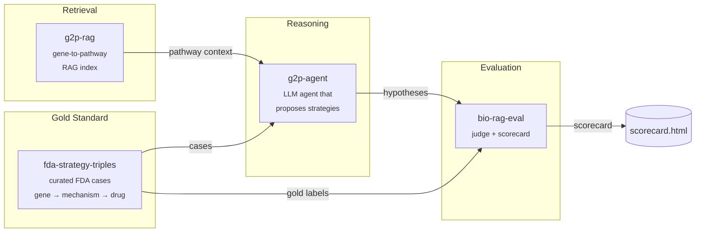

# therapy-stack

> An open-source stack for AI-driven therapeutic strategy hypothesis generation, with reproducible evaluation.

`therapy-stack` is the orchestration layer that composes four focused packages into a single end-to-end demo: given a disease gene with a known causal mechanism, it generates a ranked list of therapeutic strategy hypotheses and scores them against FDA-approved precedents.

Domain algorithms live in the four child repos. This repo holds the orchestration, the published docs, and a minimal end-to-end harness in [`sandbox/`](sandbox/) that runs the whole pipeline locally against real data with **no API keys required** — a free, open-source 3 B Llama model on CPU.

---

## Architecture



---

## Why four repos?

Each child repo solves one well-defined problem and is independently testable, citable, and installable. The split mirrors the natural boundaries of the system: a dataset (`fda-strategy-triples`), a retriever (`g2p-rag`), a reasoner (`g2p-agent`), and a judge (`bio-rag-eval`). Anyone can swap out a single component — a different retriever, a different judge model — without forking the whole stack. `therapy-stack` is the demo that proves the pieces fit together.

Child repos:

| Repo | What it does |
|---|---|
| [`fda-strategy-triples`](https://github.com/xX-its-amit-Xx/fda-strategy-triples) | Curated dataset of FDA-approved therapeutic strategies as (gene, mechanism, drug) triples — 10 cases, human-validated against ChEMBL/DrugBank/DailyMed |
| [`g2p-rag`](https://github.com/xX-its-amit-Xx/g2p-rag) | Hybrid dense+sparse retrieval over the Broad Institute G2P portal (UniProt + AlphaFold + ClinVar) |
| [`g2p-agent`](https://github.com/xX-its-amit-Xx/g2p-agent) | Claude tool-using agent that answers variant-level questions over the g2p-rag index |
| [`bio-rag-eval`](https://github.com/xX-its-amit-Xx/bio-rag-eval) | LLM-as-judge evaluation harness with deterministic + semantic scoring |

---

## Quickstart — run the real blinded benchmark locally

The runnable demo lives in [`sandbox/`](sandbox/). It drives the **real `therapy-agent` LangGraph pipeline** with a local Llama-3.2-3B model via `llama-cpp-python` — no API keys, no GPU required.

```powershell
git clone https://github.com/xX-its-amit-Xx/therapy-stack.git
cd therapy-stack/sandbox

# Python 3.11 venv (uv handles the install)
uv venv --python 3.11 .venv
$env:UV_CACHE_DIR = "C:/uv-cache"  # uv cache off the project drive

# Runtime deps from abetlen's prebuilt CPU wheels
uv pip install --python ./.venv/Scripts/python.exe `
    llama-cpp-python `
    --extra-index-url https://abetlen.github.io/llama-cpp-python/whl/cpu
uv pip install --python ./.venv/Scripts/python.exe `
    langgraph langchain-core httpx typer rich pydantic pyyaml `
    tenacity python-dotenv huggingface_hub pandas pyarrow requests
uv pip install --python ./.venv/Scripts/python.exe `
    -e ../../fda-strategy-triples --no-deps `
    -e ../../therapy-agent --no-deps

# Download Llama 3.2 3B Instruct Q4_K_M (~1.9 GB)
./.venv/Scripts/python.exe -c "from huggingface_hub import hf_hub_download; `
    hf_hub_download( `
      repo_id='bartowski/Llama-3.2-3B-Instruct-GGUF', `
      filename='Llama-3.2-3B-Instruct-Q4_K_M.gguf', `
      local_dir='C:/llama-models')"

# Blinded run: 10 YAML benchmark cases through the real therapy-agent
$env:THERAPY_AGENT_LLM_BACKEND = "llama"
./.venv/Scripts/python.exe run_blinded.py --out blinded_results.json
```

To run the Claude path instead, set `ANTHROPIC_API_KEY` and `THERAPY_AGENT_LLM_BACKEND=anthropic`. The prompts and tooling are identical.

---

## Demos

| Path | Description |
|---|---|
| [`sandbox/run_e2e.py`](sandbox/run_e2e.py) | Working end-to-end on real FDA cases with a local Llama-3.2-3B model — no API key |
| [`sandbox/RESULTS.md`](sandbox/RESULTS.md) | Per-case agent traces and ranks from the most recent run |

---

## Latest scorecard — v0.4 (real biology for candidate interactors)

v0.3 stripped the leakage and dropped to 4/10 (below the 6/10 baseline). v0.4 then added a new LangGraph node, `interactor_biology_lookup`, that fetches UniProt biology for the top candidate interactors (not just the disease gene) and a key-mismatch fix so the druggability counts in the prompt are no longer always zero. Result: overall recovery is **3/10** but the case mix shifts toward reasoning — **3 of 5 "hard" cases recover** (target != disease gene), vs 2 in v0.3 and 0 in the trivial baseline.

| Metric | v0.4 | v0.3 | v0.2 (leaky) |
|---|---|---|---|
| Target recovery | **3 / 10** (Wilson CI 11-60%) | 4 / 10 | 7 / 10 |
| Hard cases (target != disease gene) | **3 / 5** | 2 / 5 | — |
| Easy cases (target == disease gene) | 0 / 5 | 2 / 5 | — |
| Modality also correct | 3 / 10 | 2 / 10 | not measured |
| Citation also correct | 4 / 10 | 4 / 10 | not measured |
| Full (target + modality + citation) | 0 / 10 | 0 / 10 | not measured |
| Baseline: predict-disease-gene | 6 / 10 (0/5 hard) | 6 / 10 | — |
| Baseline: first-Reactome-interactor | 6 / 10 | 6 / 10 | — |

### What changed in v0.4 (the actual fixes)

1. **New `interactor_biology_lookup` node** between `druggable_target_search` and `strategy_synthesis`. For the top-5 druggable candidate interactors, it fetches UniProt FUNCTION / PATHWAY / SUBUNIT / PTM / LIPIDATION / DISEASE chunks via the same g2p-rag fallback the disease gene uses. The LLM now compares biology *across* candidates rather than picking blind from a list of gene symbols.
2. **Schema bug fixed in `strategy_synthesis`**: the v0.3 code read `chembl_compounds` / `drugbank_drugs` from the candidate-target dicts, but the upstream v0.3 schema actually writes `chembl_n_active`. So the "druggability" numbers shown to the LLM were always `0` regardless of how many ChEMBL compounds existed. Now reads the right keys.
3. **`pathway_context` one-liner surfaced** in the prompt. In v0.3 it was read into a local variable and silently discarded. Now appears under "Pathway role of disease gene".

### How to read v0.4 vs v0.3

Total recovery dropped from 4 to 3, but the *kind* of cases recovered shifted. v0.4 picks up porphyria (HMBS -> ALAS1, an upstream rate-limiting enzyme — real reasoning the v0.3 model couldn't do) but loses fh_pcsk9 and scd_hbb (where seeing biology for other interactors tempted the model into picking a partner rather than the disease gene itself). The net is fewer easy cases and more hard cases — which is the right signal for whether the pipeline is reasoning.

The 3 hard-case recoveries in v0.4 are:
- **BRD4780 / UMOD → TMED9** — picked the cargo receptor from UniProt SUBUNIT chunks for UMOD that name TMED9/TMED2/TMED10
- **POMC obesity → MC4R** — picked the downstream receptor by chaining "missing hormone → receptor agonist bypass"
- **Givlaari / HMBS → ALAS1** — picked the upstream rate-limiting enzyme using ALAS1's UniProt FUNCTION chunk ("delta-aminolevulinate synthase, first committed step of heme biosynthesis"), which the new interactor lookup made visible

These are recoveries the v0.3 model couldn't get because it had no biology for the non-disease-gene candidates. They're also the kind of reasoning the always-predict-disease-gene baseline can never do.

The 3 B Llama still under-performs on cases where the disease gene *is* the FDA target — it over-reads the rich interactor biology and goes hunting for a partner. A larger model would weight the disease-gene-is-target option more conservatively.

---

## Cite this work

If you use `therapy-stack` or any of its components in your research, please cite the relevant child repo(s):

```bibtex
@software{shenoy_therapy_stack_2026,
  author  = {Shenoy, Amit},
  title   = {therapy-stack: An open-source orchestration layer for AI-driven therapeutic strategy generation},
  year    = {2026},
  url     = {https://github.com/xX-its-amit-Xx/therapy-stack},
  version = {0.1.0}
}

@software{shenoy_g2p_rag_2026,
  author  = {Shenoy, Amit},
  title   = {g2p-rag: Retrieval-augmented generation over the Broad Institute G2P portal},
  year    = {2026},
  url     = {https://github.com/xX-its-amit-Xx/g2p-rag},
  version = {0.1.0}
}

@software{shenoy_fda_strategy_triples_2026,
  author  = {Shenoy, Amit},
  title   = {fda-strategy-triples: A curated dataset of FDA-approved therapeutic strategies},
  year    = {2026},
  url     = {https://github.com/xX-its-amit-Xx/fda-strategy-triples},
  version = {0.1.0}
}

@software{shenoy_g2p_agent_2026,
  author  = {Shenoy, Amit},
  title   = {g2p-agent: A retrieval-augmented Claude agent over G2P portal data},
  year    = {2026},
  url     = {https://github.com/xX-its-amit-Xx/g2p-agent},
  version = {0.1.0}
}

@software{shenoy_bio_rag_eval_2026,
  author  = {Shenoy, Amit},
  title   = {bio-rag-eval: LLM-as-judge evaluation harness for biomedical RAG},
  year    = {2026},
  url     = {https://github.com/xX-its-amit-Xx/bio-rag-eval},
  version = {0.1.0}
}
```

---

## Roadmap

**v0.2.0 targets:**
- Expand the FDA case set from 10 → 30+ approvals, including more recent 2024–2025 entries
- Add a second LLM judge (GPT-4-class) to cross-check `bio-rag-eval` scores and report inter-judge agreement
- Expand pathway coverage in `g2p-rag` to include WikiPathways and a curated subset of SIGNOR
- Multi-step agent traces: let `therapy-agent` issue follow-up retrieval calls instead of one-shot reasoning
- A web UI for interactively browsing cases and scores, and the Claude-path scorecard side-by-side with the Llama-path scorecard

See [ARCHITECTURE.md](ARCHITECTURE.md) for a deeper component-by-component explanation.

---

## License

GNU General Public License v3.0 — see [LICENSE](LICENSE).
