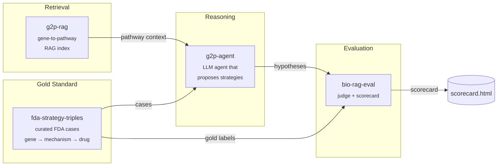

# therapy-stack

> An open-source stack for AI-driven therapeutic strategy hypothesis generation, with reproducible evaluation.

`therapy-stack` is the orchestration layer that composes four focused packages into a single end-to-end demo: given a disease gene with a known causal mechanism, it generates a ranked list of therapeutic strategy hypotheses and scores them against FDA-approved precedents.

Domain algorithms live in the four child repos. This repo holds the orchestration, the published docs, and a minimal end-to-end harness in [`sandbox/`](sandbox/) that runs the whole pipeline locally against real data with **no API keys required** — a free, open-source 3 B Llama model on CPU.

---

## Architecture



---

## Why four repos?

Each child repo solves one well-defined problem and is independently testable, citable, and installable. The split mirrors the natural boundaries of the system: a dataset (`fda-strategy-triples`), a retriever (`g2p-rag`), a reasoner (`g2p-agent`), and a judge (`bio-rag-eval`). Anyone can swap out a single component — a different retriever, a different judge model — without forking the whole stack. `therapy-stack` is the demo that proves the pieces fit together.

Child repos:

| Repo | What it does |
|---|---|
| [`fda-strategy-triples`](https://github.com/xX-its-amit-Xx/fda-strategy-triples) | Curated dataset of FDA-approved therapeutic strategies as (gene, mechanism, drug) triples — 10 cases, human-validated against ChEMBL/DrugBank/DailyMed |
| [`g2p-rag`](https://github.com/xX-its-amit-Xx/g2p-rag) | Hybrid dense+sparse retrieval over the Broad Institute G2P portal (UniProt + AlphaFold + ClinVar) |
| [`g2p-agent`](https://github.com/xX-its-amit-Xx/g2p-agent) | Claude tool-using agent that answers variant-level questions over the g2p-rag index |
| [`bio-rag-eval`](https://github.com/xX-its-amit-Xx/bio-rag-eval) | LLM-as-judge evaluation harness with deterministic + semantic scoring |

---

## Quickstart — run the real blinded benchmark locally

The runnable demo lives in [`sandbox/`](sandbox/). It drives the **real `therapy-agent` LangGraph pipeline** with a local Llama-3.2-3B model via `llama-cpp-python` — no API keys, no GPU required.

```powershell
git clone https://github.com/xX-its-amit-Xx/therapy-stack.git
cd therapy-stack/sandbox

# Python 3.11 venv (uv handles the install)
uv venv --python 3.11 .venv
$env:UV_CACHE_DIR = "C:/uv-cache"  # uv cache off the project drive

# Runtime deps from abetlen's prebuilt CPU wheels
uv pip install --python ./.venv/Scripts/python.exe `
    llama-cpp-python `
    --extra-index-url https://abetlen.github.io/llama-cpp-python/whl/cpu
uv pip install --python ./.venv/Scripts/python.exe `
    langgraph langchain-core httpx typer rich pydantic pyyaml `
    tenacity python-dotenv huggingface_hub pandas pyarrow requests
uv pip install --python ./.venv/Scripts/python.exe `
    -e ../../fda-strategy-triples --no-deps `
    -e ../../therapy-agent --no-deps

# Download Llama 3.2 3B Instruct Q4_K_M (~1.9 GB)
./.venv/Scripts/python.exe -c "from huggingface_hub import hf_hub_download; `
    hf_hub_download( `
      repo_id='bartowski/Llama-3.2-3B-Instruct-GGUF', `
      filename='Llama-3.2-3B-Instruct-Q4_K_M.gguf', `
      local_dir='C:/llama-models')"

# Blinded run: 10 YAML benchmark cases through the real therapy-agent
$env:THERAPY_AGENT_LLM_BACKEND = "llama"
./.venv/Scripts/python.exe run_blinded.py --out blinded_results.json
```

To run the Claude path instead, set `ANTHROPIC_API_KEY` and `THERAPY_AGENT_LLM_BACKEND=anthropic`. The prompts and tooling are identical.

---

## Demos

| Path | Description |
|---|---|
| [`sandbox/run_e2e.py`](sandbox/run_e2e.py) | Working end-to-end on real FDA cases with a local Llama-3.2-3B model — no API key |
| [`sandbox/RESULTS.md`](sandbox/RESULTS.md) | Per-case agent traces and ranks from the most recent run |

---

## Latest scorecard — dev / val / frontier comparison

The benchmark now runs against three configurations: local Llama 3.2 3B, local DeepSeek-R1-Distill-Llama-8B, and GPT-4o via the OpenAI API. The full pipeline + prompts are the same across all three (2-stage decomposition + self-consistency vote + always-fire critique). The split is dev (16 cases, used for iteration) vs val (6 cases, FDA approvals after the model training cutoffs). Per-case detail in [`sandbox/RESULTS_BLINDED.md`](sandbox/RESULTS_BLINDED.md) and [`sandbox/RESULTS_FRONTIER.md`](sandbox/RESULTS_FRONTIER.md).

| Backend | Set | Target | Hard | Easy | Wall | Cost |
|---|---|---|---|---|---|---|
| R1-Distill 8B (local CPU) | dev | 13/16 | 6/8 | 7/8 | 127 min | ~$0 |
| R1-Distill 8B (local CPU) | val | 3/6 | 0/3 | 3/3 | 46 min | ~$0 |
| **GPT-4o (OpenAI)** | **dev** | **16/16** | **8/8** | **8/8** | **4 min** | **$0.06** |
| GPT-4o (OpenAI) | val | 2/6 | 0/3 | 2/3 | 1 min | $0.03 |

**Baselines (no LLM):** disease-gene 9/16 dev, 3/6 val.

### The most important finding from this work

**GPT-4o is perfect on dev (16/16 with all 8 hard cases) but *worse than R1-Distill 8B* on val (2/6 vs 3/6) and worse than the disease-gene baseline.**

That gap means the val ceiling is not a model-size problem. Larger models memorize more of the published FDA-approval literature, which inflates dev scores, but they do not generalize cross-pathway reasoning to post-cutoff approvals. Scaling the model from here is the wrong investment. The pipeline ceiling is real.

The frontier model's val misses are also illuminating:
- Crinecerfont CAH → predicted "Mineralocorticoid receptor" (treats salt-wasting in CAH but is not the FDA target).
- Resmetirom MASH → predicted "RXRA" (heterodimerizes with THRB; adjacent biology).
- Sotatercept PAH → predicted "BMPR2" (the disease gene; the answer is ACVR2A).
- Garadacimab HAE → predicted "KLKB1", which is the Ekterly target from *another* HAE case in dev. The model copied a dev mapping into a novel case.

GPT-4o is "more creative" and proposes sophisticated adjacent biology. For a target-proposer with a defined FDA answer, that creativity is a liability — R1-Distill's conservatism on easy cases is why it outscored GPT-4o on val despite being ~20× smaller.

### What this implies for next investments

Confirmed by the frontier comparison, in priority order:

1. **Tool-use agentic loop** — let `strategy_synthesis` issue follow-up retrieval calls (`list upstream proteins in steroidogenesis for CYP21A2` → CRH, ACTH, CRHR1, MC2R). Directly addresses the 0/3 hard val finding.
2. **Hybrid graph + LLM** — for cases where "rate-limiting upstream enzyme" or "downstream effector" is computable from Reactome edges, compute it deterministically and feed as a constrained candidate.
3. **Adversarial dev cases** — dev = 16/16 means dev is now saturated for GPT-4o; need cases designed to fail the agent without leaking the answer.
4. **Expand val to 15-20 cases** — N=6 with Wilson CI 19-81% can't statistically distinguish 2/6 from 4/6.

### Production layer (unchanged)

- [`baselines.json`](baselines.json) — frozen scores the CI regression check gates against. Update only with reviewer sign-off.
- [`scripts/regression_check.py`](scripts/regression_check.py) — fails the build if target or hard-case recovery drops more than the tolerance, or wall time climbs > 25%.
- [`.github/workflows/benchmark.yml`](.github/workflows/benchmark.yml) — smoke job + benchmark job (gated on `ANTHROPIC_API_KEY` or `OPENAI_API_KEY` repo secret).
- [`RUNBOOK.md`](RUNBOOK.md) — on-call doc with splits, run commands, regression-check semantics, common failure modes, quarterly val-set rotation policy.
- `run_blinded.py` emits per-case `tokens_in_total` / `tokens_out_total` / `llm_calls_per_node` for cost / latency budgets.

---

## Cite this work

If you use `therapy-stack` or any of its components in your research, please cite the relevant child repo(s):

```bibtex
@software{shenoy_therapy_stack_2026,
  author  = {Shenoy, Amit},
  title   = {therapy-stack: An open-source orchestration layer for AI-driven therapeutic strategy generation},
  year    = {2026},
  url     = {https://github.com/xX-its-amit-Xx/therapy-stack},
  version = {0.1.0}
}

@software{shenoy_g2p_rag_2026,
  author  = {Shenoy, Amit},
  title   = {g2p-rag: Retrieval-augmented generation over the Broad Institute G2P portal},
  year    = {2026},
  url     = {https://github.com/xX-its-amit-Xx/g2p-rag},
  version = {0.1.0}
}

@software{shenoy_fda_strategy_triples_2026,
  author  = {Shenoy, Amit},
  title   = {fda-strategy-triples: A curated dataset of FDA-approved therapeutic strategies},
  year    = {2026},
  url     = {https://github.com/xX-its-amit-Xx/fda-strategy-triples},
  version = {0.1.0}
}

@software{shenoy_g2p_agent_2026,
  author  = {Shenoy, Amit},
  title   = {g2p-agent: A retrieval-augmented Claude agent over G2P portal data},
  year    = {2026},
  url     = {https://github.com/xX-its-amit-Xx/g2p-agent},
  version = {0.1.0}
}

@software{shenoy_bio_rag_eval_2026,
  author  = {Shenoy, Amit},
  title   = {bio-rag-eval: LLM-as-judge evaluation harness for biomedical RAG},
  year    = {2026},
  url     = {https://github.com/xX-its-amit-Xx/bio-rag-eval},
  version = {0.1.0}
}
```

---

## Roadmap

**v0.2.0 targets:**
- Expand the FDA case set from 10 → 30+ approvals, including more recent 2024–2025 entries
- Add a second LLM judge (GPT-4-class) to cross-check `bio-rag-eval` scores and report inter-judge agreement
- Expand pathway coverage in `g2p-rag` to include WikiPathways and a curated subset of SIGNOR
- Multi-step agent traces: let `therapy-agent` issue follow-up retrieval calls instead of one-shot reasoning
- A web UI for interactively browsing cases and scores, and the Claude-path scorecard side-by-side with the Llama-path scorecard

See [ARCHITECTURE.md](ARCHITECTURE.md) for a deeper component-by-component explanation.

---

## License

GNU General Public License v3.0 — see [LICENSE](LICENSE).
