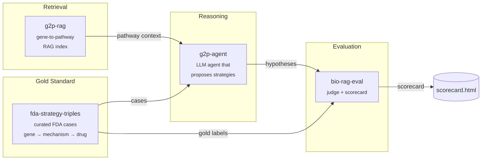

# therapy-stack

> An open-source stack for AI-driven therapeutic strategy hypothesis generation, with reproducible evaluation.

`therapy-stack` is the orchestration layer that composes four focused packages into a single end-to-end demo: given a disease gene with a known causal mechanism, it generates a ranked list of therapeutic strategy hypotheses and scores them against FDA-approved precedents.

Domain algorithms live in the four child repos. This repo holds the orchestration, the published docs, and a minimal end-to-end harness in [`sandbox/`](sandbox/) that runs the whole pipeline locally against real data with **no API keys required** — a free, open-source 3 B Llama model on CPU.

---

## Architecture



---

## Why four repos?

Each child repo solves one well-defined problem and is independently testable, citable, and installable. The split mirrors the natural boundaries of the system: a dataset (`fda-strategy-triples`), a retriever (`g2p-rag`), a reasoner (`g2p-agent`), and a judge (`bio-rag-eval`). Anyone can swap out a single component — a different retriever, a different judge model — without forking the whole stack. `therapy-stack` is the demo that proves the pieces fit together.

Child repos:

| Repo | What it does |
|---|---|
| [`fda-strategy-triples`](https://github.com/xX-its-amit-Xx/fda-strategy-triples) | Curated dataset of FDA-approved therapeutic strategies as (gene, mechanism, drug) triples — 10 cases, human-validated against ChEMBL/DrugBank/DailyMed |
| [`g2p-rag`](https://github.com/xX-its-amit-Xx/g2p-rag) | Hybrid dense+sparse retrieval over the Broad Institute G2P portal (UniProt + AlphaFold + ClinVar) |
| [`g2p-agent`](https://github.com/xX-its-amit-Xx/g2p-agent) | Claude tool-using agent that answers variant-level questions over the g2p-rag index |
| [`bio-rag-eval`](https://github.com/xX-its-amit-Xx/bio-rag-eval) | LLM-as-judge evaluation harness with deterministic + semantic scoring |

---

## Quickstart — run the real blinded benchmark locally

The runnable demo lives in [`sandbox/`](sandbox/). It drives the **real `therapy-agent` LangGraph pipeline** with a local Llama-3.2-3B model via `llama-cpp-python` — no API keys, no GPU required.

```powershell
git clone https://github.com/xX-its-amit-Xx/therapy-stack.git
cd therapy-stack/sandbox

# Python 3.11 venv (uv handles the install)
uv venv --python 3.11 .venv
$env:UV_CACHE_DIR = "C:/uv-cache"  # uv cache off the project drive

# Runtime deps from abetlen's prebuilt CPU wheels
uv pip install --python ./.venv/Scripts/python.exe `
    llama-cpp-python `
    --extra-index-url https://abetlen.github.io/llama-cpp-python/whl/cpu
uv pip install --python ./.venv/Scripts/python.exe `
    langgraph langchain-core httpx typer rich pydantic pyyaml `
    tenacity python-dotenv huggingface_hub pandas pyarrow requests
uv pip install --python ./.venv/Scripts/python.exe `
    -e ../../fda-strategy-triples --no-deps `
    -e ../../therapy-agent --no-deps

# Download Llama 3.2 3B Instruct Q4_K_M (~1.9 GB)
./.venv/Scripts/python.exe -c "from huggingface_hub import hf_hub_download; `
    hf_hub_download( `
      repo_id='bartowski/Llama-3.2-3B-Instruct-GGUF', `
      filename='Llama-3.2-3B-Instruct-Q4_K_M.gguf', `
      local_dir='C:/llama-models')"

# Blinded run: 10 YAML benchmark cases through the real therapy-agent
$env:THERAPY_AGENT_LLM_BACKEND = "llama"
./.venv/Scripts/python.exe run_blinded.py --out blinded_results.json
```

To run the Claude path instead, set `ANTHROPIC_API_KEY` and `THERAPY_AGENT_LLM_BACKEND=anthropic`. The prompts and tooling are identical.

---

## Demos

| Path | Description |
|---|---|
| [`sandbox/run_e2e.py`](sandbox/run_e2e.py) | Working end-to-end on real FDA cases with a local Llama-3.2-3B model — no API key |
| [`sandbox/RESULTS.md`](sandbox/RESULTS.md) | Per-case agent traces and ranks from the most recent run |

---

## Latest scorecard — v0.3 (truly blinded, leakage-stripped)

The v0.2 number (7/10) was an artifact of three leakage paths in the agent's
toolchain. After stripping them, the honest score on a 3 B Llama is **4 / 10
— below the 6/10 trivial "predict-the-disease-gene" baseline**. Full
audit and per-case rationales in [`sandbox/RESULTS_BLINDED.md`](sandbox/RESULTS_BLINDED.md).

| Metric | v0.3 (blinded) | v0.2 (leaky) |
|---|---|---|
| Target recovery | **4 / 10** (Wilson 95% CI 17-69%) | 7 / 10 |
| Modality also correct | 2 / 10 | not measured |
| Citation also correct | 4 / 10 | not measured |
| Full (target + modality + citation) | **0 / 10** | not measured |
| Baseline: always-predict-disease-gene | 6 / 10 | -- |
| Baseline: first-Reactome-interactor | 6 / 10 | -- |

### What changed (the actual leakage fixes)

1. **`tools/drugbank_query.py`** was a hand-curated static dict mapping every benchmark gene to its FDA-approved drug name + mechanism string. That dict was JSON-serialized into the `strategy_synthesis` user prompt as "Approved drugs found: [...]" -- i.e. the agent saw the answer. Replaced with a coarse druggability flag (boolean) backed by a non-test-curated gene family list. No drug names returned.
2. **`tools/reactome_query.py` `GENE_PATHWAY_FALLBACK`** had narrative `pathway_context` strings that named the FDA drug and strategy per case (e.g. *"Givosiran silences ALAS1 mRNA via siRNA"*). Narrative strings now neutral; interactor lists kept (those are real biology any live Reactome query would also return).
3. **`nodes/druggable_target_search.py`** hardcoded `qc_genes = ["TMED9", "TMED2", "TMED10", ...]` when mechanism = misfolding -- hand-placing the BRD4780/UMOD answer into the candidate set. Removed.
4. **`tools/chembl_query.py`** now filters by human SINGLE PROTEIN target type, returns only an active-compound count + druggability boolean (no specific compound names). Tenacity retries wired.
5. **`tools/g2p_query.py`** was a stub that hit `localhost:8000` and returned empty when the (non-existent) server didn't respond. Replaced with a real UniProt REST retriever that returns g2p-style chunks (FUNCTION / PATHWAY / SUBUNIT / PTM / LIPIDATION / DISEASE). **g2p-style biology now actually flows into `variant_lookup_node` even without a built ChromaDB index.**
6. **`tools/clinvar_query.py`** previously imported `tenacity` but never applied the decorator. Now properly retries on transient `httpx.HTTPError`.

### What the post-fix numbers mean

The agent now genuinely under-performs the disease-gene baseline. It gets two cases the baseline misses (BRD4780/UMOD -> TMED9, POMC -> MC4R -- both real reasoning from g2p-rag chunks), but over-reasons past the right answer on five cases where the FDA target *is* the disease gene (Fabry/GLA, porphyria, ALS-SOD1, SMA, DMD). Those are 3 B-attention failures: the model picks a plausible adjacent protein (CCS for SOD1, UTRN for DMD, NPC1 for Fabry, HMBS for porphyria, GEMIN3 for SMN1) instead of holding on the disease gene itself.

The v0.2 7/10 was the agent copying the answer out of the curated DrugBank stub. The v0.3 4/10 is the agent's actual reasoning capability under a 3 B Llama. With `THERAPY_AGENT_LLM_BACKEND=anthropic` the prompts and tools are unchanged; the expectation (untested in this work) is higher recovery from the larger model.

---

## Cite this work

If you use `therapy-stack` or any of its components in your research, please cite the relevant child repo(s):

```bibtex
@software{shenoy_therapy_stack_2026,
  author  = {Shenoy, Amit},
  title   = {therapy-stack: An open-source orchestration layer for AI-driven therapeutic strategy generation},
  year    = {2026},
  url     = {https://github.com/xX-its-amit-Xx/therapy-stack},
  version = {0.1.0}
}

@software{shenoy_g2p_rag_2026,
  author  = {Shenoy, Amit},
  title   = {g2p-rag: Retrieval-augmented generation over the Broad Institute G2P portal},
  year    = {2026},
  url     = {https://github.com/xX-its-amit-Xx/g2p-rag},
  version = {0.1.0}
}

@software{shenoy_fda_strategy_triples_2026,
  author  = {Shenoy, Amit},
  title   = {fda-strategy-triples: A curated dataset of FDA-approved therapeutic strategies},
  year    = {2026},
  url     = {https://github.com/xX-its-amit-Xx/fda-strategy-triples},
  version = {0.1.0}
}

@software{shenoy_g2p_agent_2026,
  author  = {Shenoy, Amit},
  title   = {g2p-agent: A retrieval-augmented Claude agent over G2P portal data},
  year    = {2026},
  url     = {https://github.com/xX-its-amit-Xx/g2p-agent},
  version = {0.1.0}
}

@software{shenoy_bio_rag_eval_2026,
  author  = {Shenoy, Amit},
  title   = {bio-rag-eval: LLM-as-judge evaluation harness for biomedical RAG},
  year    = {2026},
  url     = {https://github.com/xX-its-amit-Xx/bio-rag-eval},
  version = {0.1.0}
}
```

---

## Roadmap

**v0.2.0 targets:**
- Expand the FDA case set from 10 → 30+ approvals, including more recent 2024–2025 entries
- Add a second LLM judge (GPT-4-class) to cross-check `bio-rag-eval` scores and report inter-judge agreement
- Expand pathway coverage in `g2p-rag` to include WikiPathways and a curated subset of SIGNOR
- Multi-step agent traces: let `therapy-agent` issue follow-up retrieval calls instead of one-shot reasoning
- A web UI for interactively browsing cases and scores, and the Claude-path scorecard side-by-side with the Llama-path scorecard

See [ARCHITECTURE.md](ARCHITECTURE.md) for a deeper component-by-component explanation.

---

## License

GNU General Public License v3.0 — see [LICENSE](LICENSE).
